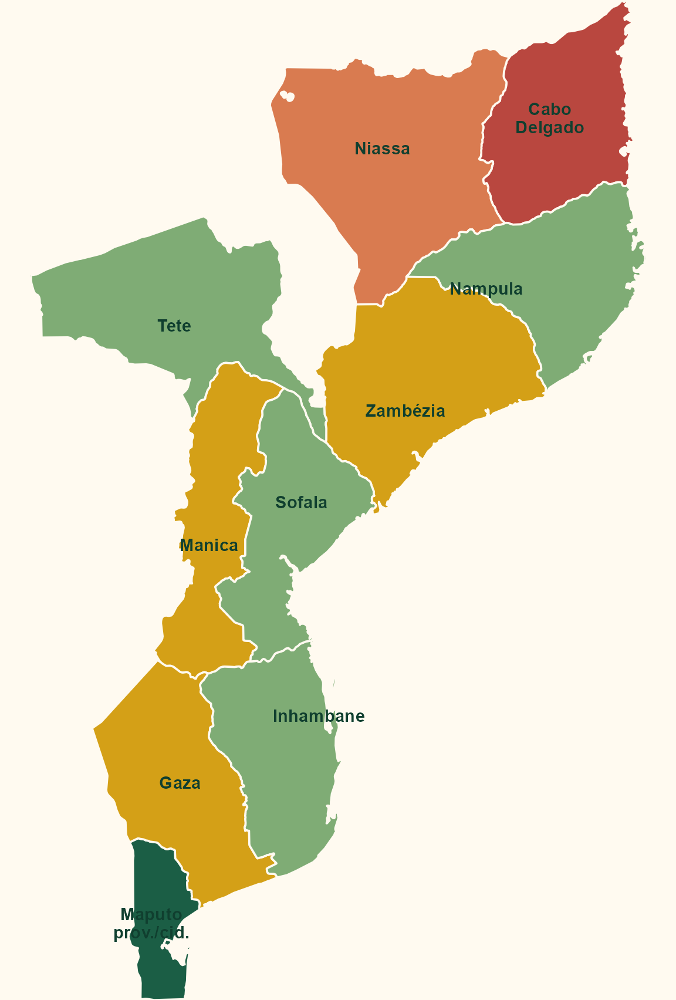

## Fontes oficiais do governo

::: big
Não há sinal claro de uma base pública oficial específica sobre Koro.
:::

:::::: cards
::: card
**MISAU / SIS-MA**\
Sistema nacional de informação em saúde, baseado em DHIS2, com dados agregados, vigilância e módulos de programas.
:::

::: card
**INS / vigilância**\
Instituto Nacional de Saúde, SIGILA e unidades de inquéritos/vigilância para eventos laboratoriais e epidemiológicos.
:::

::: card
**INE**\
Censos, projeções, estatísticas provinciais e denominadores populacionais para interpretar desigualdades territoriais.
:::

::: card
**INCM / INTIC**\
Regulação, qualidade de telecomunicações, indicadores TIC, cobertura e governança digital.
:::
::::::

## Acesso à Internet: base nacional

-   Em outubro de 2025, Moçambique tinha cerca de **7,12 milhões de usuários de Internet**, com penetração de **19,8%**; 80,2% da população seguia offline segundo o DataReportal.
-   Havia **19,1 milhões de conexões móveis celulares**, equivalentes a **53,1%** da população; nem toda conexão móvel inclui dados.
-   A população era majoritariamente rural: **60% rural** e **40% urbana** em 2025.
-   A Internet Society estima penetração nacional próxima de **21%** e registra, em dados comparáveis de 2017, forte desigualdade urbano-rural: **18% urbana** versus **3% rural**.

::: callout
Implicação para Koro: sinais digitais tendem a super-representar centros urbanos, homens, pessoas com maior renda/escolaridade, usuários de smartphone e áreas cobertas por operadores móveis.
:::

## Cobertura regional: leitura operacional

::::: columns
::: {.column width="48%"}
{fig-alt="Mapa de Moçambique com classificação operacional de sinal digital esperado por província."}
:::

::: {.column width="52%"}
::: timeline
**Norte**\
Niassa: muito baixo. Cabo Delgado: muito baixo e instável. Nampula: médio nos centros urbanos, baixo no interior.

**Centro**\
Zambézia e Manica: baixo fora dos centros. Tete e Sofala: médio em corredores urbanos, mineração e Beira; baixo no interior.

**Sul**\
Gaza: baixo fora de Xai-Xai. Inhambane: médio em centros e áreas turísticas. Maputo província e Cidade de Maputo: maior sinal digital.
:::
:::
:::::

::: notes
Este mapa cobre as dez províncias e a Cidade de Maputo, mas a classificação é deliberadamente operacional. Não há uma base pública recente, granular e completa de usuários de Internet por província; o quadro combina dados nacionais, ruralidade, infraestrutura móvel, conflito e evidências abertas sobre cobertura.
:::

## Redes sociais e acesso a dados

Em 2025, as maiores audiências observáveis por ferramentas de publicidade eram:

:::::: threecols
::: colbox
**Facebook**\
4,10 milhões de usuários; principal plataforma para busca ampla e grupos locais.
:::

::: colbox
**TikTok**\
3,70 milhões de adultos alcançáveis por anúncios; útil para vídeos curtos, rumor e linguagem popular.
:::

::: colbox
**Instagram / LinkedIn / X**\
729 mil, 880 mil membros e 150 mil usuários, respectivamente; mais segmentados.
:::
::::::

**Restrições práticas**

-   WhatsApp é provavelmente central para circulação local, mas é fechado, criptografado e sem API pública adequada para leitura de grupos.
-   Facebook/Instagram exigem caminhos controlados, como Meta Content Library/API para pesquisadores elegíveis.
-   TikTok Research API requer aprovação e impõe critérios e cotas.
-   YouTube é mais acessível via API, mas tem cotas e viés para conteúdo público indexado.
-   Durante a crise pós-eleitoral de 2024, houve evidências de bloqueios ou limitações a Facebook, Instagram e WhatsApp em alguns provedores.

## GDELT como camada de notícias

::: big
GDELT é uma base global de notícias online: monitora matérias publicadas na web, identifica eventos, temas, atores, lugares e disponibiliza consultas por API.
:::

Para Koro em Moçambique, funciona como **camada de imprensa e web aberta**, não como vigilância de casos.

::::: columns
::: {.column width="50%"}
**Possibilidades**

-   buscar `Koro`, variantes locais e termos associados;
-   filtrar por **Moçambique**, províncias e janelas curtas;
-   gerar séries temporais, alertas e mapas;
-   combinar `stories` e `events`.
:::

::: {.column width="50%"}
**Limitações**

-   depende de fontes jornalísticas indexadas;
-   perde WhatsApp, rádio, línguas nacionais e relatos orais;
-   geocodificação e classificação podem errar;
-   rumor, violência e saúde podem se misturar.
:::
:::::

## Uma possível estratégia

:::::: cards
::: card
**1. Vocabulário vivo**\
Começar com Koro e expandir termos por província, idioma, metáforas locais e expressões usadas pela imprensa e redes.
:::

::: card
**2. Fontes em camadas**\
GDELT + busca web + páginas públicas + TikTok/YouTube + imprensa local + fontes institucionais e humanitárias.
:::

::: card
**3. Triangulação territorial**\
Separar Maputo/sul urbano, centros de Nampula/Zambézia e norte rural/conflito para não confundir silêncio digital com ausência de evento.
:::

::: card
**4. Ética e segurança**\
Evitar identificação de pessoas e comunidades; tratar rumores como risco social, não como confirmação clínica.
:::
::::::

::: callout
Principal conclusão: buscar Koro na Internet em Moçambique é menos uma pergunta sobre "onde há casos" e mais uma pergunta sobre **onde há sinal digital observável**.
:::

## Fontes principais {.smaller}

-   DataReportal: [Digital 2026: Mozambique](https://datareportal.com/reports/digital-2026-mozambique)
-   Internet Society Pulse: [Country Report for Mozambique](https://pulse.internetsociety.org/en/reports/mz/)
-   MISAU: [SIS-MA](https://sisma.misau.gov.mz/)
-   INS: [SIGILA](https://sigila.ins.gov.mz/) e [Departamento de Inquéritos e Vigilância em Saúde](https://ins.gov.mz/institucional/unidade-organicas/direccoes/direccao-de-inqueritos-e-observacao-de-saude/departamento-de-inqueritos-e-vigilancia-em-saude/)
-   INS: [Comunicados](https://ins.gov.mz/publicacoes/comunicados/)
-   INE: [Instituto Nacional de Estatística](https://www.ine.gov.mz/) e [OpenData](https://nso-mozambique.opendataforafrica.org/?lang=pt)
-   INCM: [Qualidade de Serviço de Telecomunicações 2024](https://www.incm.gov.mz/index.php/mercado/qualidade-de-servico/331-resumo-do-relato-rio-qualidade-de-servico-de-telecomunicacoes-2024)
-   INTIC: [Sistematização dos Indicadores de TIC em Moçambique: 2017-2024](https://intic.gov.mz/wp-content/uploads/2025/05/MEDICAO_DA_SOCIEDADE_DE_INFORMACAO_EM_MOCAMBIQUE_assinado.pdf)
-   Portal do Governo: [Comunicados de imprensa](https://portaldogoverno.gov.mz/comunicados-de-imprensa/)
-   Imprensa Nacional: [Boletim da República](https://www.inm.gov.mz/pt-br/bulletin)
-   CSIRT.GOV: [Equipa de Resposta a Incidentes de Segurança Cibernética](https://csirt.gov.mz/)

## Fontes técnicas e abertas {.smaller}

-   Natural Earth: [Admin 1 states/provinces](https://github.com/nvkelso/natural-earth-vector)
-   GDELT Cloud: [API v2 documentation](https://docs.gdeltcloud.com/api-reference/v2)
-   SOMAR/ICPSR: [Meta Content Library](https://www.icpsr.umich.edu/sites/somar/meta-content-library)
-   TikTok for Developers: [Research API FAQ](https://developers.tiktok.com/doc/research-api-faq)
-   Google for Developers: [YouTube Data API overview](https://developers.google.com/youtube/v3/getting-started)
-   Amnesty International: [Mozambique post-2024 election crackdown](https://www.amnesty.org/en/latest/research/2025/04/mozambique-police-protest-crackdown/)
