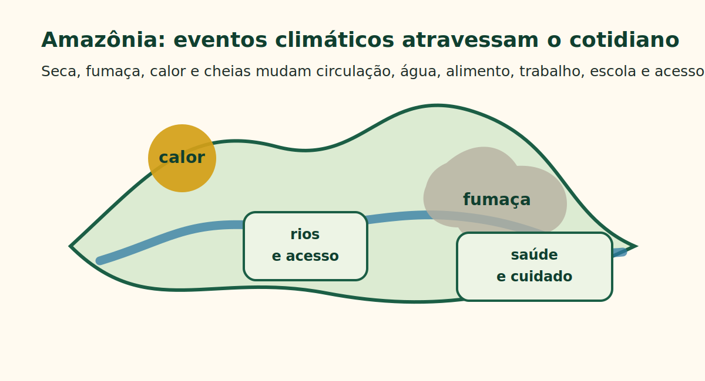
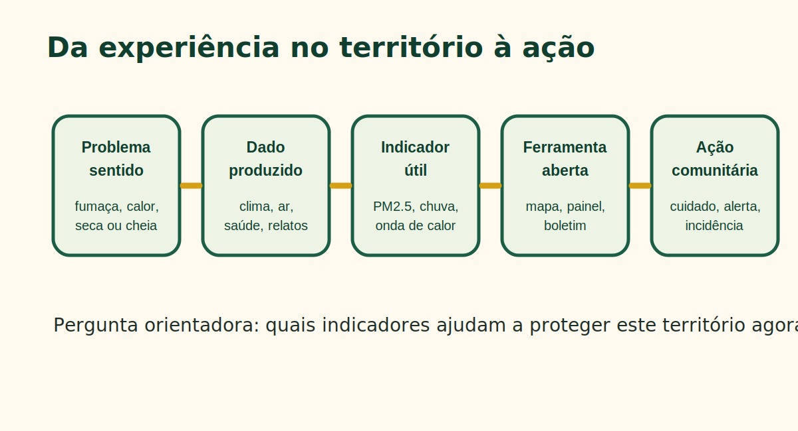
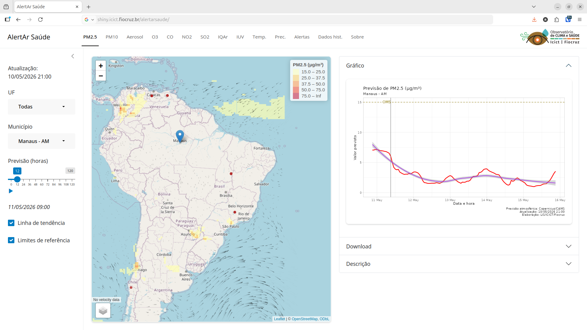

## Uma pergunta para começar

::: big
Quais sinais da mudança climática aparecem no território antes de aparecerem nos dados oficiais?
:::

Pode ser a fumaça chegando, o rio baixando, a água mudando, o calor ficando insuportável, a escola suspendendo atividades ou a UBS recebendo mais pessoas com sintomas respiratórios.

::: callout
A proposta é aproximar os **dados produzidos pelo Observatório de Clima e Saúde** da Fiocruz com os saberes e práticas de **monitoramento territorial independente**.
:::

::: notes
Abrir perguntando ao público: “Que sinais vocês monitoram no território?”. A apresentação deve reconhecer que o território já produz evidências, mesmo quando elas ainda não estão em bases oficiais.
:::

## Impactos

::: big
As mudanças climáticas não afetam apenas o ambiente: elas atravessam **corpos**, **modos de vida** e **territórios**.
:::

Para agir, precisamos combinar:

:::::: threecols
::: colbox
**Dados públicos**\
clima, ar, ambiente e saúde
:::

::: colbox
**Monitoramento territorial**\
saberes locais e vigilância popular
:::

::: colbox
**Ferramentas abertas**\
mapas, alertas e evidências
:::
::::::

::: notes
Dizer que tecnologia não substitui monitoramento comunitário. A função dos sistemas é fortalecer a leitura do território e apoiar decisões.
:::

## Amazônia: eventos climáticos e cotidiano

{fig-alt="Esquema de eventos climáticos na Amazônia e efeitos no cotidiano"}

::: notes
Usar exemplos concretos: seca dos rios, fumaça de queimadas, calor extremo, interrupção de transporte, dificuldade de acesso à água e maior procura por serviços de saúde.
:::

## Por que falar de clima e saúde na Amazônia?

A Amazônia concentra processos que se sobrepõem:

::::: twocols
::: left
-   queimadas, fumaça e poluição do ar;
-   secas severas e seca dos rios;
-   cheias, enchentes e inundações;
-   calor extremo e noites quentes.
:::

::: right
-   alteração do acesso à água e aos alimentos;
-   isolamento de comunidades;
-   pressão sobre territórios e modos de vida;
-   interrupção de escola, trabalho, transporte e cuidado.
:::
:::::

Esses eventos afetam a saúde por caminhos diretos e indiretos: respiração, calor, água, alimentação, deslocamento, acesso aos serviços, saúde mental e organização comunitária.

## Saúde de corpos e territórios

::: quote
Corpos adoecem quando territórios são degradados; territórios adoecem quando águas, florestas, caminhos, redes de cuidado e modos de vida são interrompidos.
:::

**Corpos** sentem a fumaça, o calor, a água contaminada, o medo, a perda e o esforço de viver em condições adversas.

**Territórios** registram mudanças no rio, na floresta, no ar, nos alimentos, na circulação e nos serviços.

**Monitorar** é transformar sinais do território em informação para proteger vidas e direitos.

## Observatório de Clima e Saúde

1.  produzir **dados territoriais** sobre clima, ambiente e saúde;
2.  transformar dados em **indicadores compreensíveis**;
3.  disponibilizar **sistemas de visualização e alerta**;
4.  apoiar pesquisa, gestão pública, comunicação de risco e monitoramento comunitário;
5.  construir pontes entre dados técnicos e evidências produzidas pelos territórios.

::: notes
Explicar que o Observatório atua com ciência de dados, geografia da saúde, epidemiologia, sistemas de informação e visualização territorial.
:::

## Como atuamos

::: timeline
**1. Coleta e integração**\
Bases públicas, sensoriamento remoto, reanálises climáticas, modelos atmosféricos e sistemas de saúde.

**2. Territorialização**\
Transformação de grades climáticas e atmosféricas em indicadores por município, região ou recorte territorial.

**3. Indicadores**\
Calor, chuva, seca, umidade, qualidade do ar, população exposta e agravos à saúde.

**4. Sistemas e comunicação**\
Mapas, gráficos, painéis, relatórios, cursos, notas técnicas e alertas.
:::

::: notes
Traduzir termos técnicos: reanálise climática é uma forma de reconstruir o clima combinando observações e modelos. Territorialização é transformar uma grade de dados em informação útil para municípios e territórios.
:::

## Alguns dados que produzimos

:::::: threecols
::: colbox
**Clima**\
Temperatura, chuva, umidade, ondas de calor, noites quentes, estiagens e eventos extremos.
:::

::: colbox
**Qualidade do ar**\
PM2.5, PM10, ozônio, NO₂ e SO₂, com histórico e previsão para municípios brasileiros.
:::

::: colbox
**Saúde e população**\
Hospitalizações, mortalidade, doenças sensíveis ao clima, denominadores populacionais e indicadores territoriais.
:::
::::::

Esses dados são organizados para apoiar mapas, séries temporais, indicadores de risco e estudos sobre desigualdades territoriais em saúde.

## Metodologia de monitoramento

::::::: cards
::: card
**1. Dados climáticos e atmosféricos**\
ERA5-Land, CAMS, satélites, modelos e previsões.
:::

::: card
**2. Dados de saúde**\
Sistemas do SUS, hospitalizações, mortalidade, agravos e indicadores populacionais.
:::

::: card
**3. Indicadores territoriais**\
Eventos extremos, exposição, vulnerabilidade, acesso a serviços e desigualdades.
:::

::: card
**4. Ferramentas e uso social**\
AlertAr Saúde, mapas, boletins, cursos, protocolos e comunicação acessível.
:::
:::::::

::: notes
Aqui vale dizer que a metodologia começa com perguntas reais do território, não com a base de dados. Os dados precisam responder a uma necessidade concreta.
:::

## Da experiência no território à ação

{fig-alt="Fluxo problema no território, dado produzido, indicador, ferramenta e ação comunitária"}

::: notes
Frase-chave: problema no território → dado produzido → indicador → ferramenta → ação comunitária.
:::

## Temas e indicadores prioritários

| Tema | Indicadores possíveis | Perguntas para o território |
|------------------------|------------------------|------------------------|
| Fumaça e ar | PM2.5, PM10, previsão de poluentes | Quando a fumaça chega? Quem precisa ser protegido primeiro? |
| Calor | dias quentes, ondas de calor, noites quentes | Quais grupos sofrem mais? Há locais de abrigo e hidratação? |
| Seca | chuva acumulada, dias secos, umidade | Como muda o acesso à água, alimento, transporte e cuidado? |
| Cheias | chuva extrema, áreas alagadas, acesso a serviços | Quem fica isolado? Quais serviços são interrompidos? |
| Saúde | internações, sintomas, doenças infecciosas | O evento climático aparece nos dados de saúde e nos relatos locais? |

## Ferramentas e publicações

::::: twocols
::: left
**Ferramentas e bases**

-   **AlertAr Saúde**: previsão e acompanhamento da qualidade do ar;
-   **Mapas do Observatório**: indicadores climáticos, ambientais e de saúde;
-   **{climindi}**: indicadores climáticos baseados em eventos;
-   **{rpcdas}**: acesso programático a dados de saúde da PCDaS;
-   bases municipalizadas de clima, umidade, chuva e poluição.
:::

::: right
**Produtos e formação**

-   artigos científicos e manuscritos em desenvolvimento;
-   notas técnicas e relatórios, incluindo a crise de saúde da população Yanomami;
-   cursos, disciplinas e oficinas;
-   materiais de comunicação e apoio à decisão;
-   diálogo com redes, gestores e territórios.

**Exemplo aplicado:** a nota técnica sobre a Terra Indígena Yanomami mostrou como dados territoriais podem apoiar a identificação de áreas críticas e o direcionamento de respostas em situações de emergência sanitária.
:::
:::::

## AlertAr Saúde: o que é

::: big
Sistema de alerta precoce sobre **poluição do ar** e efeitos na saúde para municípios brasileiros.
:::

O sistema permite acompanhar:

::::: twocols
::: left
-   situação atual e previsão da qualidade do ar;
-   deslocamento de poluentes;
-   mapas e gráficos por município;
-   previsão com horizonte de até 120 horas.
:::

::: right
-   PM2.5 e PM10;
-   ozônio;
-   dióxido de nitrogênio;
-   dióxido de enxofre;
-   apoio à comunicação de risco.
:::
:::::

::: notes
Explicar PM2.5 em linguagem simples: partículas muito pequenas, frequentemente associadas à fumaça, que podem entrar profundamente no sistema respiratório.
:::

## AlertAr Saúde na prática

{fig-alt="Mockup didático do sistema AlertAr Saúde"}

::: notes
Este visual é um mockup didático. Se houver uma captura real do sistema, basta substituir o arquivo assets/alertar_mockup.svg por uma imagem PNG ou JPG com o mesmo nome ou ajustar o caminho no slide.
:::

## Exemplo: episódio de fumaça em um município amazônico

::: scenario
**Antes**\
O AlertAr indica aumento de PM2.5 nos próximos dias. Lideranças e equipes locais observam fumaça, baixa visibilidade e relatos de irritação nos olhos.

**Durante**\
A comunidade registra sintomas, orienta grupos vulnerabilizados, dialoga com escolas, UBS e defesa civil, e evita atividades externas nos horários mais críticos.

**Depois**\
Os dados do sistema, os relatos comunitários e os registros de saúde são comparados para produzir evidência, memória do evento e demanda por resposta pública.
:::

::: notes
Dizer que o exemplo é fictício, mas baseado em situações comuns em períodos de seca e queimada. O objetivo é mostrar o uso da ferramenta no ciclo antes-durante-depois.
:::

## Como o AlertAr pode apoiar territórios amazônicos

Durante fumaça, queimada ou seca, o AlertAr pode ajudar a:

::::::: cards
::: card
**Antecipar**\
identificar dias críticos antes da exposição mais intensa.
:::

::: card
**Comunicar**\
traduzir previsão técnica em orientação local.
:::

::: card
**Priorizar**\
crianças, idosos, gestantes, pessoas com asma e trabalhadores expostos.
:::

::: card
**Registrar**\
comparar alertas, relatos comunitários e dados de saúde.
:::
:::::::

## Evidências sobre impactos na saúde

O monitoramento integrado permite produzir evidências sobre:

::::: twocols
::: left
-   períodos e territórios com maior exposição à fumaça;
-   relação entre eventos extremos e procura por serviços de saúde;
-   interrupção de acesso a cuidado, escola, trabalho e transporte.
:::

::: right
-   desigualdades de exposição e resposta;
-   grupos mais vulnerabilizados;
-   efeitos acumulados de seca, fumaça, calor e cheias.
:::
:::::

Essas evidências podem apoiar planos locais, pedidos de resposta emergencial, comunicação pública e defesa de direitos territoriais. Na crise de saúde Yanomami, esse tipo de abordagem orientou uma nota técnica com cenários de impacto para apoiar intervenções na Terra Indígena Yanomami.

::: notes
Mencionar rapidamente a nota técnica Yanomami como exemplo de aplicação dos dados territoriais em uma emergência real. Não detalhar demais para preservar o tempo: a ideia é mostrar que os dados podem apoiar priorização de áreas, resposta pública e defesa de direitos.
:::

## Como começar um monitoramento territorial de clima e saúde

::: numbered
1.  Escolher um problema sentido no território: fumaça, calor, seca ou cheia.
2.  Definir sinais locais: sintomas, água, deslocamento, escola, trabalho, alimento.
3.  Escolher indicadores complementares: ar, chuva, temperatura, saúde.
4.  Acompanhar antes, durante e depois do evento.
5.  Comunicar de forma simples: alerta, boletim, mapa, reunião ou áudio.
6.  Usar a evidência para cuidado, prevenção, incidência e proteção de direitos.
:::

::: notes
Este é um dos slides mais importantes para o público. Apresentar como convite prático, não como receita fechada.
:::

## O que pode ser feito junto com a Rede MTI?

::::: twocols
::: left
**A partir dos dados**

-   oficinas de leitura de mapas;
-   protocolos simples de monitoramento;
-   boletins territoriais;
-   painéis por município ou região;
-   comparação entre previsão, exposição e saúde.
:::

::: right
**A partir dos territórios**

-   validação comunitária dos indicadores;
-   inclusão de relatos e sinais locais;
-   definição de prioridades;
-   comunicação acessível para ação rápida;
-   construção de evidências para incidência.
:::
:::::

::: callout
O próximo passo é aproximar os dados produzidos pelo Observatório dos registros comunitários da Rede MTI.
:::

## Conclusão

::: big
Dados não substituem o conhecimento do território.\
Eles podem fortalecer esse conhecimento.
:::

Para enfrentar os impactos das mudanças climáticas na Amazônia, precisamos de monitoramento que seja:

::: keywords
**territorial** · **participativo** · **aberto** · **compreensível** · **orientado à ação**
:::

::: quote
A pergunta final não é apenas “que dados temos?”, mas “que dados ajudam a proteger vidas, territórios e direitos agora?”.
:::

## Fontes e links úteis

-   Observatório de Clima e Saúde: <https://climaesaude.icict.fiocruz.br/>
-   Instagram: observatorio_climaesaude
-   AlertAr Saúde: <https://shiny.icict.fiocruz.br/alertarsaude/>
-   Página sobre o AlertAr Saúde: <https://climaesaude.icict.fiocruz.br/conheca-o-alertar-saude>
-   Notas técnicas do Observatório: <https://climaesaude.icict.fiocruz.br/pagina/notas-tecnicas>
-   Notícia Fiocruz sobre a crise Yanomami: <https://fiocruz.br/noticia/2023/06/mais-da-metade-das-comunidades-yanomami-vivem-em-situacao-de-risco-de-saude>
-   Pacote `{climindi}`: <https://rfsaldanha.github.io/climindi/>
-   Pacote `{rpcdas}`: <https://rfsaldanha.github.io/rpcdas/>
-   Esta apresentação e outros materiais: <https://rfsaldanha.github.io/>

raphael.saldanha\@fiocruz.br