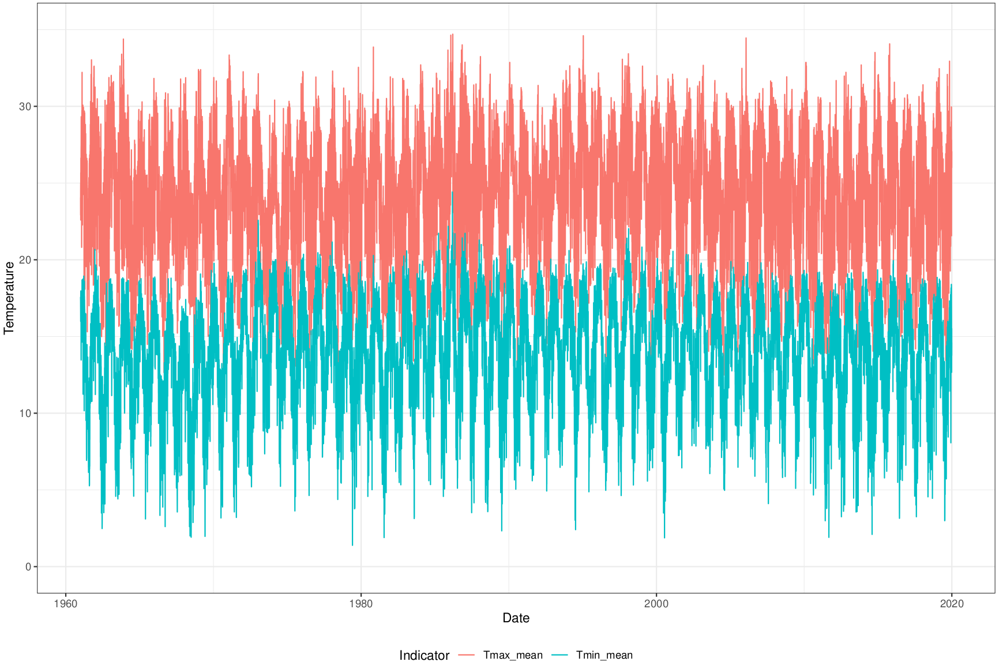

## Introdução

Indicadores climáticos são usados em vários modelos estatísticos de diferentes áreas de pesquisa e são especialmente importantes para modelar a incidência de doenças sensíveis ao clima. Esses modelos geralmente adotam uma estrutura espacial em que os dados são agregados por limites administrativos, enquanto os indicadores climáticos costumam ser apresentados em grades regulares contínuas.

Para tornar indicadores climáticos compatíveis com essas estruturas, podem ser usadas estatísticas zonais. Estatísticas zonais são estatísticas descritivas calculadas a partir de células que intersectam um limite espacial. Para cada limite no mapa, estatísticas como média, máximo, mínimo, desvio padrão e soma representam os valores das células que intersectam a área.

Criei bases de estatísticas zonais de indicadores climáticos para municípios brasileiros a partir de diferentes produtos de dados climáticos.

## Estatísticas zonais ERA5-Land

1950-2022: [](https://doi.org/10.5281/zenodo.10036211)

2023: [](https://doi.org/10.5281/zenodo.10947952)

2024: [](https://doi.org/10.5281/zenodo.15748125)

2025: [](https://doi.org/10.5281/zenodo.18257037)

Umidade relativa (1950 - 2025): [](https://doi.org/10.5281/zenodo.18392587)

Velocidade do vento (1950 - 2025): [](https://doi.org/10.5281/zenodo.18390794)

Os dados ERA5-Land [@muñoz-sabater2021] apresentam indicadores climáticos horários em resolução horizontal de 0,1° × 0,1°, com cobertura global, de 1950 até o presente.

Dados horários de indicadores selecionados foram [baixados e agregados em escala diária](era5land-daily-latin-america.html) para calcular estatísticas zonais para os municípios brasileiros.

Foram calculados os seguintes indicadores e agregações.

| Indicadores ERA5-Land | Funções de agregação diária | Estatísticas zonais espaciais |
|--------------------|----------------------------|------------------------|
| Temperatura (2m) | média, máximo, mínimo | média, máximo, mínimo, desvio padrão, contagem |
| Temperatura do ponto de orvalho (2m) | média | média, máximo, mínimo, desvio padrão, contagem |
| Componente $u$ do vento | média | média, máximo, mínimo, desvio padrão, contagem |
| Componente $v$ do vento | média | média, máximo, mínimo, desvio padrão, contagem |
| Pressão de superfície | média | média, máximo, mínimo, desvio padrão, contagem |
| Precipitação total | soma | média, máximo, mínimo, desvio padrão, contagem, soma |
| Umidade relativa | média | média |
| Velocidade do vento | média | média |

Um artigo com a metodologia completa foi publicado na revista Environmental Data Science.

[](https://doi.org/10.1017/eds.2024.3)

::: callout-tip
Esses arquivos estão em formato parquet. Não sabe como abrir arquivos parquet? Veja este [post do blog](https://rfsaldanha.github.io/posts/query_local_parquet_files.html).
:::

### Estatísticas de uso

As estatísticas de uso desta e de outras bases estão disponíveis [aqui](https://rfsaldanha.github.io/pkgdash/#datasets).

## Estatísticas zonais BR-DWGD

1961-01-01 a 2024-03-20: [](https://doi.org/10.5281/zenodo.13906834)

A base BR-DWGD [@xavier2022] apresenta dados meteorológicos diários interpolados para uma grade com resolução espacial de 0,1° × 0,1° para o território brasileiro, com dados diários desde 1º de janeiro de 1961. Ela usa dados de pluviômetros de várias estações meteorológicas em seus métodos de interpolação, com validação cruzada para selecionar o melhor método para cada indicador meteorológico.

Os seguintes indicadores meteorológicos estão disponíveis no estudo BR-DWGD: precipitação (mm), temperatura mínima (°C), temperatura máxima (°C), radiação solar (MJ⋅m−2), velocidade do vento a 2 m de altura (m⋅s−1) e umidade relativa (%).

Foram calculadas as seguintes estatísticas zonais.

| Indicadores BR-DWGD | Funções de agregação diária | Estatísticas zonais espaciais |
|--------------------|----------------------------|------------------------|
| Temperatura | máximo, mínimo | máximo, mínimo, desvio padrão, contagem |
| Umidade relativa | média | máximo, mínimo, desvio padrão, contagem |
| Componente $u$ do vento | média | máximo, mínimo, desvio padrão, contagem |
| Evapotranspiração | média | máximo, mínimo, desvio padrão, contagem |
| Radiação solar | média | máximo, mínimo, desvio padrão, contagem |
| Precipitação | soma | máximo, mínimo, desvio padrão, contagem, soma |

::: callout-tip
Esses arquivos estão em formato parquet. Não sabe como abrir arquivos parquet? Veja este [post do blog](https://rfsaldanha.github.io/posts/query_local_parquet_files.html).
:::

## Estatísticas zonais TerraClimate

[](https://doi.org/10.5281/zenodo.7825777)

A base TerraClimate [@abatzoglou2018] apresenta dados meteorológicos mensais interpolados para uma grade com resolução espacial de 0,04° × 0,04° (1/24 de grau), com cobertura mundial e dados mensais de janeiro de 1958 a dezembro de 2021.

Os seguintes indicadores meteorológicos estão disponíveis no estudo TerraClimate: evapotranspiração real (mm), déficit hídrico climático (mm), evapotranspiração potencial (mm), precipitação (mm), escoamento superficial (mm), umidade do solo (mm), radiação de onda curta descendente na superfície (W/m2), equivalente de água da neve (mm), temperatura mínima (°C), temperatura máxima (°C), pressão de vapor (kPa), velocidade do vento (m/s), déficit de pressão de vapor (kPa) e Palmer Drought Severity Index.

Foram calculadas as seguintes estatísticas zonais.

```{r}
brclimr::product_info(product = "terraclimate")
```

Os resultados estão disponíveis como arquivos parquet no [Zenodo](https://zenodo.org/records/7825777) e também podem ser acessados com o pacote R [brclimr](https://rfsaldanha.github.io/brclimr).

::: callout-tip
Esses arquivos estão em formato parquet. Não sabe como abrir arquivos parquet? Veja este [post do blog](https://rfsaldanha.github.io/posts/query_local_parquet_files.html).
:::
