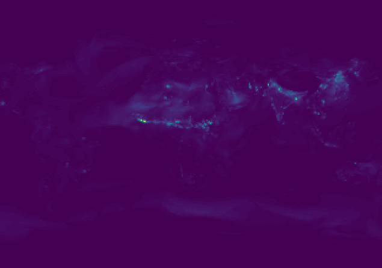

## Introdução

Poluentes atmosféricos, incluindo material particulado, dióxido de nitrogênio, dióxido de enxofre, ozônio e monóxido de carbono, são indicadores críticos em estudos de saúde pública por seus impactos na saúde humana. Esses poluentes têm várias fontes, como emissões veiculares, atividades industriais e queima de biomassa. A exposição à poluição do ar está associada a doenças respiratórias e cardiovasculares, desfechos adversos ao nascimento e aumento da mortalidade.

Criei bases de dados de poluentes atmosféricos para municípios brasileiros usando estatísticas zonais com dados da reanálise global EAC4 do Copernicus Atmosphere Monitoring Service (CAMS).

## Material particulado

Material particulado é um indicador amplamente usado em estudos de saúde pública por sua associação com desfechos adversos em saúde. Essas partículas finas podem penetrar profundamente no sistema respiratório, alcançar os alvéolos e a corrente sanguínea, aumentando os riscos de doenças cardiovasculares e respiratórias, mortalidade prematura e outras condições crônicas.

Os indicadores de PM foram baixados do Atmosphere Data Store do Copernicus e processados para fornecer três indicadores diários para os municípios brasileiros:

-   Valores mínimos: para cada limite municipal e dia, os valores horários mínimos de PM de todas as células que intersectam o município são promediados, resultando no indicador diário mínimo municipal.
-   Valores máximos: para cada limite municipal e dia, os valores horários máximos de PM de todas as células que intersectam o município são promediados, resultando no indicador diário máximo municipal.
-   Valores médios: para cada limite municipal e dia, os valores horários médios de PM de todas as células que intersectam o município são promediados, resultando no indicador diário médio municipal.

Esses indicadores são apresentados nos formatos Parquet e CSV. Os códigos computacionais usados para criar as bases estão disponíveis abertamente [aqui](https://github.com/rfsaldanha/camsdata).

As bases estão disponíveis para baixar aqui:

### PM 2.5

-  2003-2024: 
-  jan 2025 - ago 2025: 
    
### PM 10

-  2003-2024: 
-  jan 2025 - ago 2025: 

## CO

O monóxido de carbono (CO) é um gás produzido principalmente pela combustão incompleta de combustíveis fósseis e representa uma ameaça importante à saúde pública. A exposição de curto prazo a altas concentrações pode causar tontura, dor de cabeça, prejuízo visual, confusão e, em casos graves, morte. A exposição crônica a baixos níveis está associada a problemas cardiovasculares e neurológicos.

Os indicadores de CO foram baixados do Atmosphere Data Store do Copernicus e processados para fornecer três indicadores diários para os municípios brasileiros:

-   Valores mínimos: para cada limite municipal e dia, os valores horários mínimos de CO de todas as células que intersectam o município são promediados.
-   Valores máximos: para cada limite municipal e dia, os valores horários máximos de CO de todas as células que intersectam o município são promediados.
-   Valores médios: para cada limite municipal e dia, os valores horários médios de CO de todas as células que intersectam o município são promediados.

Esses indicadores são apresentados nos formatos Parquet e CSV. Os códigos computacionais usados para criar as bases estão disponíveis abertamente [aqui](https://github.com/rfsaldanha/camsdata).

As bases estão disponíveis para baixar aqui:

-  2003-2024: 
-  jan 2025 - ago 2025: 

## NO2 

O dióxido de nitrogênio (NO2) é um poluente atmosférico nocivo gerado principalmente pela combustão de combustíveis fósseis, especialmente por veículos, usinas e atividades industriais. Está relacionado a problemas respiratórios, pois a exposição pode irritar as vias aéreas, reduzir a função pulmonar e aumentar o risco de asma, bronquite e outras doenças respiratórias crônicas.

Os indicadores de NO2 foram baixados do Atmosphere Data Store do Copernicus e processados para fornecer três indicadores diários para os municípios brasileiros:

-   Valores mínimos: para cada limite municipal e dia, os valores horários mínimos de NO2 de todas as células que intersectam o município são promediados.
-   Valores máximos: para cada limite municipal e dia, os valores horários máximos de NO2 de todas as células que intersectam o município são promediados.
-   Valores médios: para cada limite municipal e dia, os valores horários médios de NO2 de todas as células que intersectam o município são promediados.

Esses indicadores são apresentados nos formatos Parquet e CSV. Os códigos computacionais usados para criar as bases estão disponíveis abertamente [aqui](https://github.com/rfsaldanha/camsdata).

As bases estão disponíveis para baixar aqui:

-  2003-2024: 
-  jan 2025 - ago 2025: 

## O3

O ozônio (O3) ao nível do solo é um componente importante do smog e um poluente atmosférico. Diferentemente do ozônio estratosférico, que protege a vida da radiação ultravioleta, o ozônio troposférico é nocivo e tem implicações relevantes para a saúde pública. A exposição de curto prazo pode irritar olhos, nariz e garganta, agravar asma e reduzir a função pulmonar.

Os indicadores de O3 foram baixados do Atmosphere Data Store do Copernicus e processados para fornecer três indicadores diários para os municípios brasileiros:

-   Valores mínimos: para cada limite municipal e dia, os valores horários mínimos de O3 de todas as células que intersectam o município são promediados.
-   Valores máximos: para cada limite municipal e dia, os valores horários máximos de O3 de todas as células que intersectam o município são promediados.
-   Valores médios: para cada limite municipal e dia, os valores horários médios de O3 de todas as células que intersectam o município são promediados.

Esses indicadores são apresentados nos formatos Parquet e CSV. Os códigos computacionais usados para criar as bases estão disponíveis abertamente [aqui](https://github.com/rfsaldanha/camsdata).

As bases estão disponíveis para baixar aqui:

-  2003-2024: 
-  jan 2025 - ago 2025: 

## SO2

O dióxido de enxofre (SO2) é um gás tóxico produzido principalmente pela queima de combustíveis fósseis contendo enxofre, como carvão e petróleo, além de processos industriais como fundição de metais e refino de óleo. Concentrações de SO2 irritam o sistema respiratório, causando tosse, irritação na garganta e falta de ar mesmo em concentrações relativamente baixas.

Os indicadores de SO2 foram baixados do Atmosphere Data Store do Copernicus e processados para fornecer três indicadores diários para os municípios brasileiros:

-   Valores mínimos: para cada limite municipal e dia, os valores horários mínimos de SO2 de todas as células que intersectam o município são promediados.
-   Valores máximos: para cada limite municipal e dia, os valores horários máximos de SO2 de todas as células que intersectam o município são promediados.
-   Valores médios: para cada limite municipal e dia, os valores horários médios de SO2 de todas as células que intersectam o município são promediados.

Esses indicadores são apresentados nos formatos Parquet e CSV. Os códigos computacionais usados para criar as bases estão disponíveis abertamente [aqui](https://github.com/rfsaldanha/camsdata).

As bases estão disponíveis para baixar aqui:

-  2003-2024: 
-  jan 2025 - ago 2025: 
