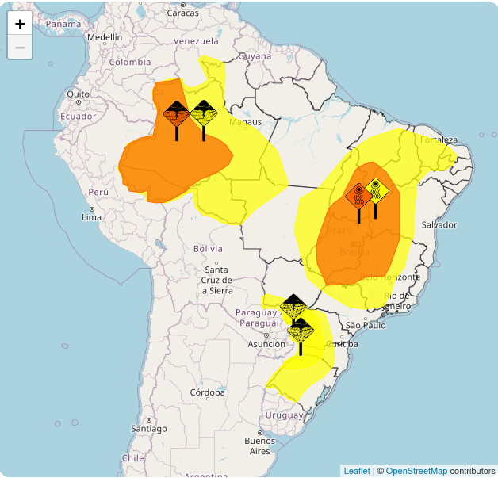

## Introdução

O INMET é a fonte oficial brasileira de previsões meteorológicas. Ele também mantém o [ALERT-AS](https://alertas2.inmet.gov.br/), um centro de alertas meteorológicos para o território brasileiro.

Os alertas são publicados em formato RSS e não há um histórico oficial disponível. Por isso, comecei a executar um script diário para registrar esses alertas e disponibilizá-los ao público. O registro começou em 29 de setembro de 2025 às 16h.

## Dados

Os alertas são coletados diariamente à 1h usando o pacote R [inmetrss](https://rfsaldanha.github.io/inmetrss/). Após coletar novos alertas e atualizar a base, um arquivo parquet é exportado para um armazenamento S3, disponível no link abaixo:

```
https://inmetalerts.nyc3.cdn.digitaloceanspaces.com/inmetalerts.parquet
```

## Uso dos dados

O arquivo parquet apresenta os alertas na estrutura original do INMET. O pacote [inmetrss](https://rfsaldanha.github.io/inmetrss/) oferece uma função para processar os alertas por município.

```{r}
#| messages: false
suppressMessages({
  library(arrow)
  library(DT)
  library(inmetrss)
})

res <- read_parquet(
  "https://inmetalerts.nyc3.cdn.digitaloceanspaces.com/inmetalerts.parquet"
)

res_mun <- parse_mun(head(res, 10))

datatable(res_mun)
```

## Informações da sessão

```{r}
sessioninfo::session_info()
```
