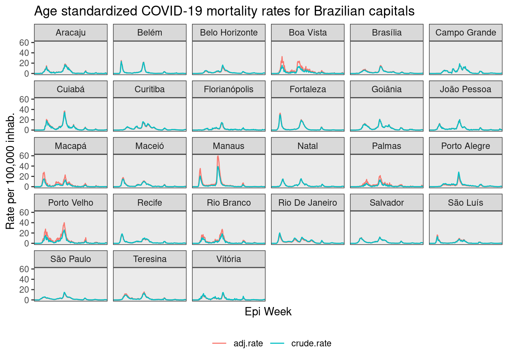

Esta base apresenta taxas brutas e padronizadas por idade de mortalidade por COVID-19 para municípios brasileiros, de 2020 a 2022, por semanas epidemiológicas.

Mais detalhes sobre a metodologia estão disponíveis neste [post do blog](https://rfsaldanha.github.io/posts/std_br_covid_rates.html).

Baixar os dados:

[{fig-align="center"}](https://doi.org/10.5281/zenodo.10078882)
