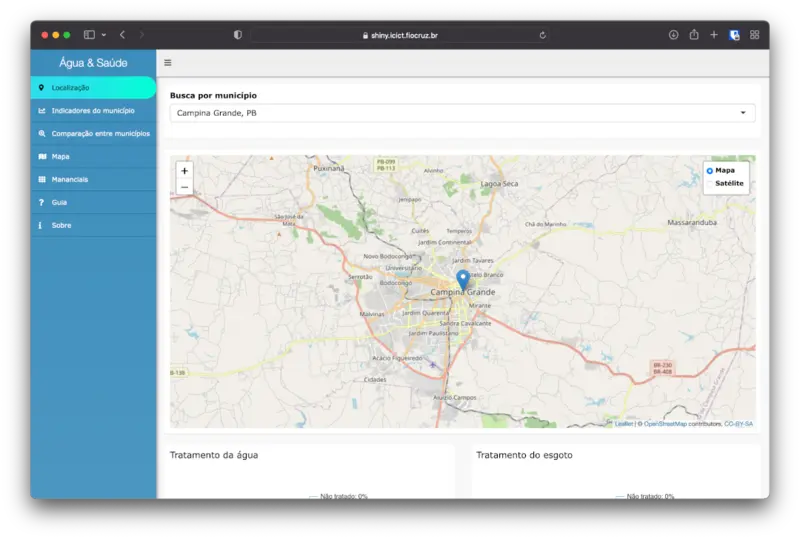

{fig-align="center"}

O primeiro projeto em que me envolvi na Fiocruz com o Observatório de Clima e Saúde. Foi um projeto em parceria com a ANA (Agência Nacional de Águas).

Fui responsável por criar uma base de indicadores de saúde e água e um painel de dados. O projeto foi desenvolvido integralmente com R, Shiny e SQLite.

O projeto foi descontinuado.
