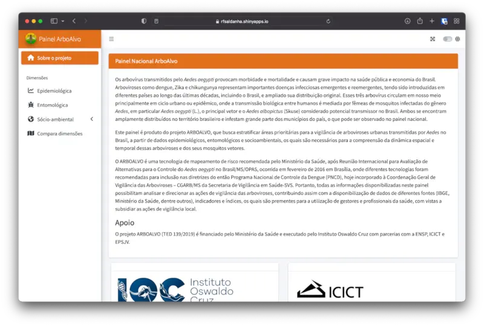
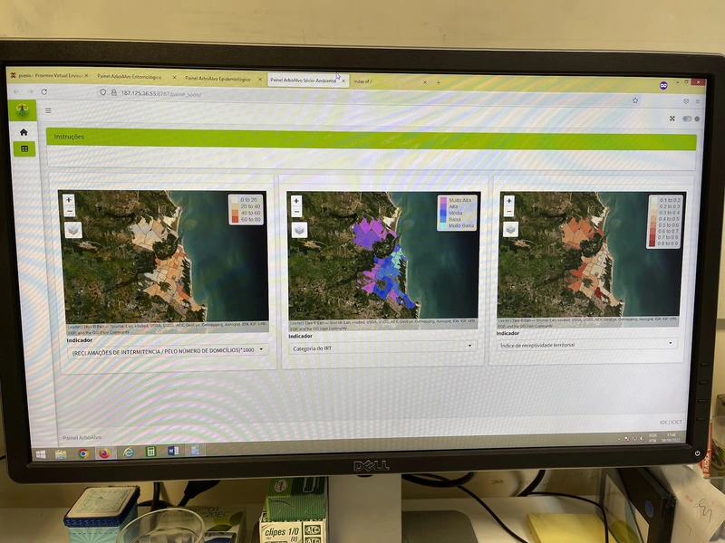
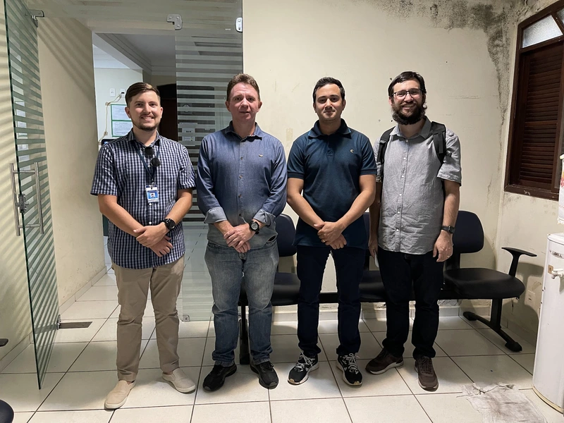

{fig-align="center"}

Conduzido no Instituto Oswaldo Cruz (IOC), o projeto ArboAlvo tem como objetivo estratificar o risco de arboviroses em níveis nacional e intramunicipal, considerando dimensões epidemiológicas, entomológicas e sociodemográficas.

Participei deste projeto criando, revisando e otimizando código para as análises de dados e desenvolvendo painéis.

{fig-align="center"}

{fig-align="center"}
