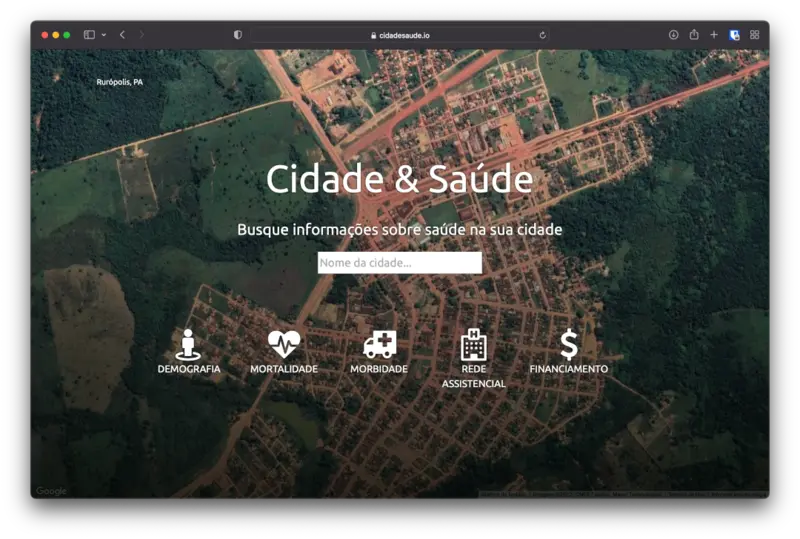

{fig-align="center"}

"Cidade & Saúde" é um projeto financiado com recursos próprios que iniciei logo após o mestrado e antes do doutorado.

O objetivo do projeto é coletar e agregar dados de saúde no nível municipal e oferecer acesso simples e visualmente atraente com imagens de satélite e gráficos. O usuário digita o nome de uma cidade e o sistema apresenta uma página com a imagem de satélite e informações sociodemográficas e de saúde em gráficos.

A imagem de satélite contextualiza os dados sociodemográficos e de saúde, com gráficos e definições de indicadores sobre aspectos demográficos, mortalidade, internações, unidades de saúde e orçamento em saúde.

O site do projeto está disponível em: https://cidadesaude.io. Os dados estão desatualizados e aguardam financiamento.
