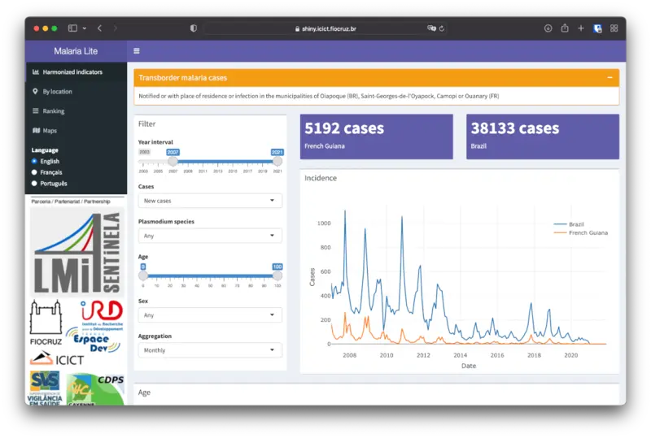
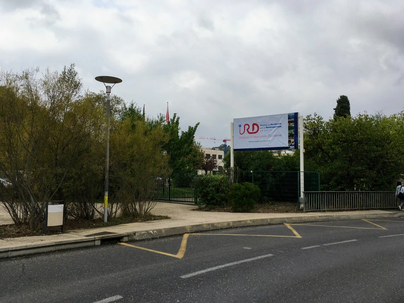
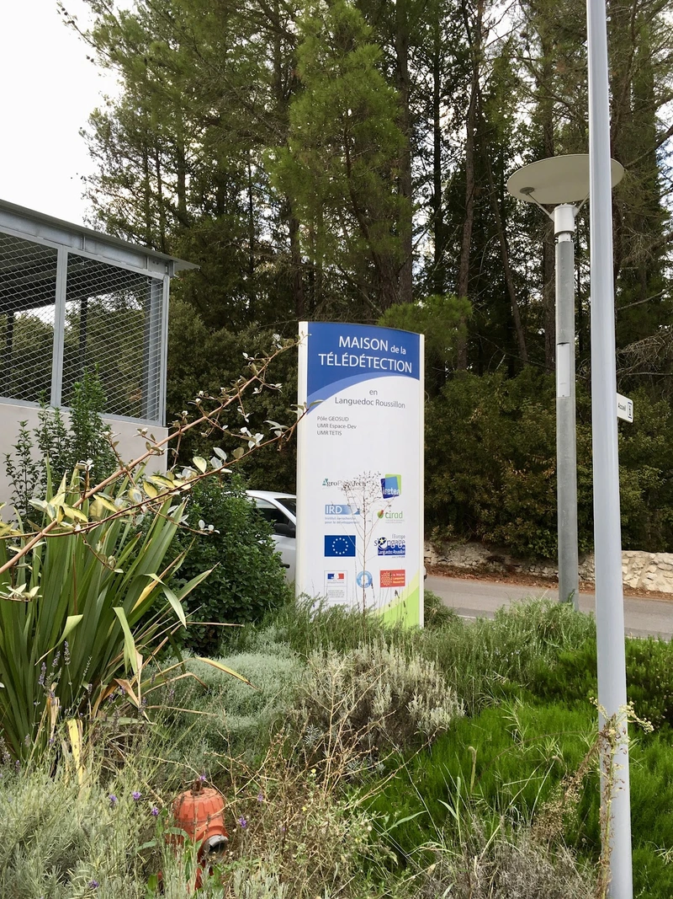
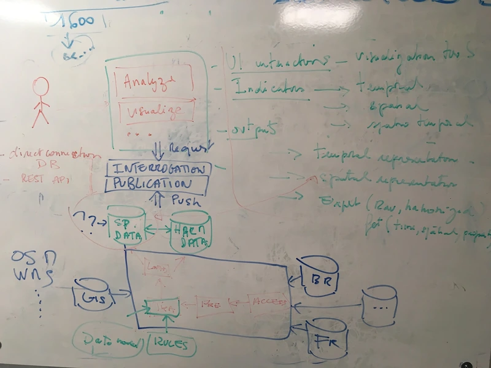
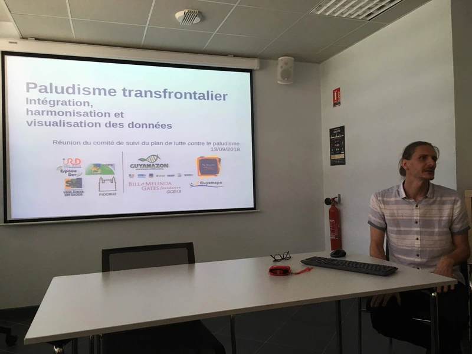
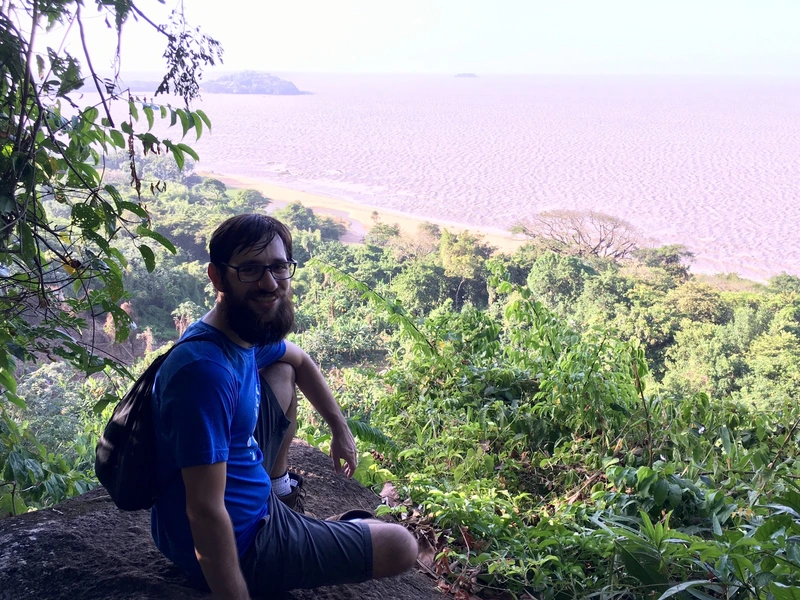

{fig-align="center"}

Este foi o segundo projeto em que me envolvi na Fiocruz com o Observatório de Clima e Saúde. Foi uma parceria com o IRD francês (Institut de Recherche pour le Développement).

Fui responsável por aportar conhecimento sobre as bases de malária no Brasil (SIVEP-Malária) e desenvolver um painel de dados mostrando a transmissão transfronteiriça de malária na fronteira entre a Guiana Francesa e o Brasil (Amapá). Foi uma tarefa especialmente difícil porque o painel precisava estar em inglês, francês e português. O painel foi desenvolvido com R e Shiny.

O projeto envolveu uma viagem de um mês a Montpellier, França, para trabalhar com outros integrantes da equipe, além de uma viagem a Caiena, capital da Guiana Francesa, para aprender de perto como os dados eram coletados e tratados.

O projeto resultou em dois artigos publicados: http://dx.doi.org/10.1186/s12879-020-05086-4 e http://dx.doi.org/10.2196/15409.

Este trabalho recebeu apoio da Bill & Melinda Gates Foundation.

{fig-align="center"}

{fig-align="center"}

{fig-align="center"}

{fig-align="center"}

{fig-align="center"}
