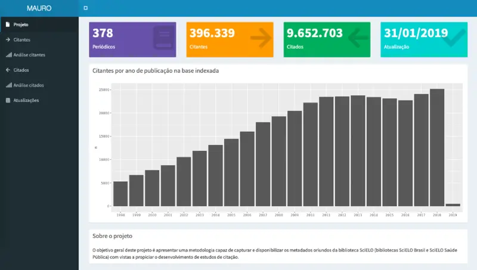

{fig-align="center"}

"Mauro" foi um projeto de pesquisa que iniciei durante meu doutorado na Fiocruz, enquanto cursava disciplinas sobre informação tecnológica em saúde.

Os objetivos do projeto eram (1) baixar e organizar informações bibliométricas disponíveis na SciELO nas coleções Saúde Pública e Brasil; e (2) oferecer uma forma simples e intuitiva para pesquisadores acessarem os dados por filtros e visualizações.

O processo de ETL e o painel foram desenvolvidos com R e Shiny. O projeto está desativado.
