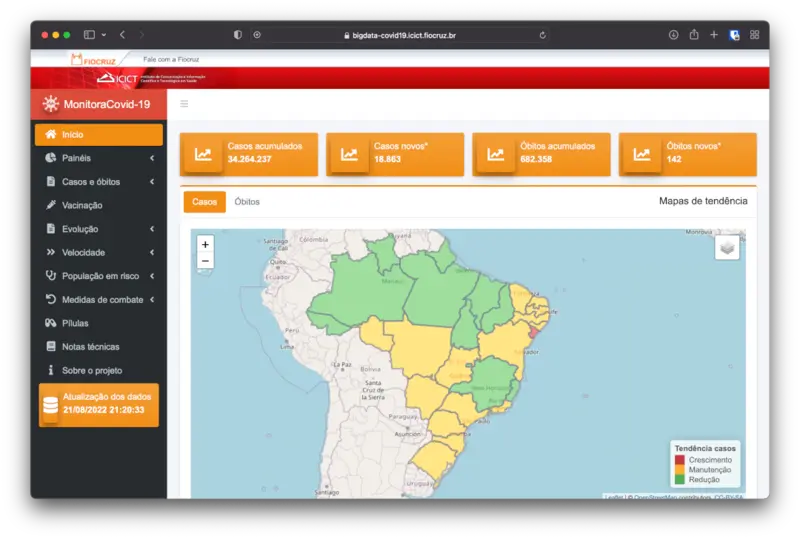

{fig-align="center"}

O projeto MonitoraCovid-19 é uma resposta institucional da Fiocruz à pandemia de Covid-19.

O projeto começou em março de 2020, quando ocorreram os primeiros casos de Covid-19 no Brasil. Desde então, monitoramos a pandemia diariamente, unificando mais de 10 fontes de dados em um painel com diversos gráficos e mapas.

Sou responsável pelo processo de ETL e pelo painel de dados. O site do projeto recebeu mais de 700 mil acessos de mais de 300 mil usuários em todo o mundo.

Publicamos 25 notas técnicas e 12 textos breves sobre a pandemia, além de artigos e um capítulo de livro.

Este trabalho foi apoiado pelo Fiocruz Inova e recebeu o [prêmio ENAP](https://www.enap.gov.br/pt/acontece/noticias/sairam-os-vencedores-do-desafios-covid-19).

Endereço do painel: https://bigdata-covid19.icict.fiocruz.br

Entrevista no Fantástico (Rede Globo, maio de 2020): https://g1.globo.com/fantastico/noticia/2020/05/10/com-medidas-mais-rigorosas-paises-vizinhos-ao-brasil-dao-exemplo-no-combate-a-covid-19.ghtml

Apresentação no Centro de Estudos do ICICT, com Atila Iamarino e Diego Xavier (19 de agosto de 2022): https://www.youtube.com/watch?v=GeyPs9yMzSk&t=3867s
