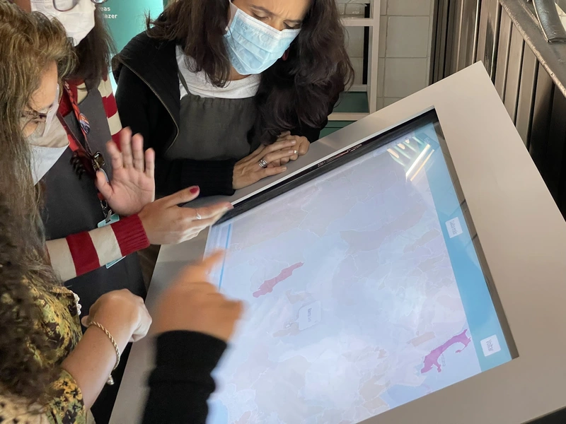
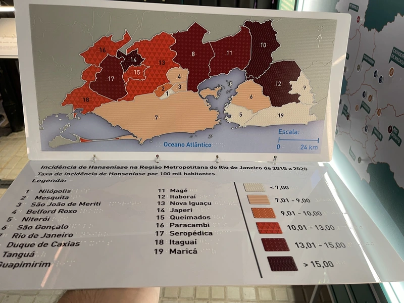
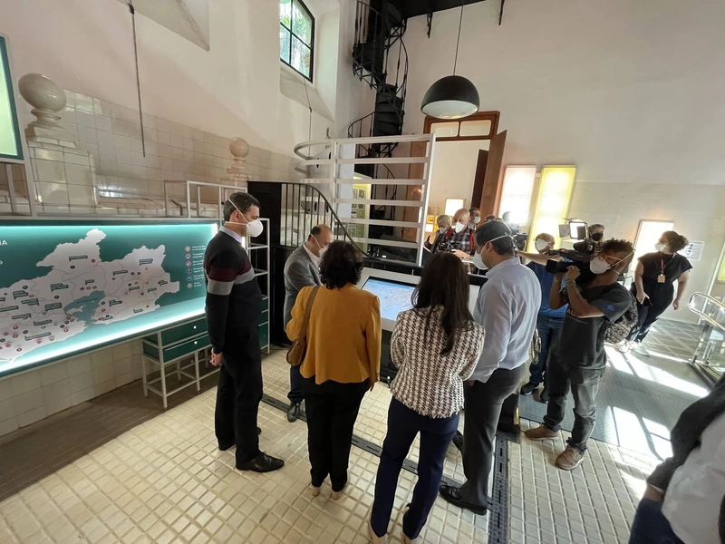

{fig-align="center"}

Este foi um projeto muito especial, no qual fomos convidados a desenvolver uma exposição museológica na Fiocruz. No espaço, apresentamos aos visitantes a relação entre saúde e espaço usando mapas interativos em uma tela ampla, além de mapas impressos e táteis para visitantes com deficiência visual.

A exposição é permanente e fica no campus Fiocruz Maré.

O mapa interativo também pode ser acessado aqui: https://rfsaldanha.github.io/app_cavalarica/

{fig-align="center"}

{fig-align="center"}
