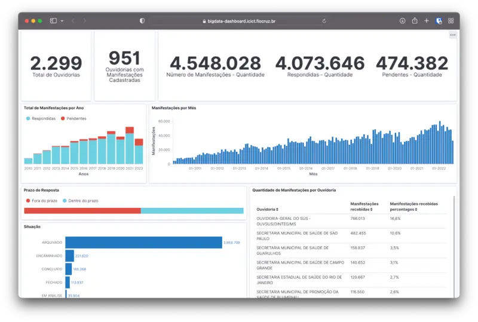

{fig-align="center"}

Uma parceria entre PCDaS, Instituto Aggeu Magalhães -- Fiocruz Pernambuco e a Ouvidoria do Ministério da Saúde. O projeto tem como objetivo coletar, organizar e apresentar dados sobre manifestações e solicitações de informação da população.

Coordeno a equipe do PCDaS responsável pelo processo de ETL (extração, transformação e carga) e pelo painel de dados.

Endereço do site do projeto: https://www.gov.br/saude/pt-br/canais-de-atendimento/ouvidoria-do-sus/ouvidoria-em-numeros/paineis-de-dados

Este trabalho é apoiado pelo Ministério da Saúde.
