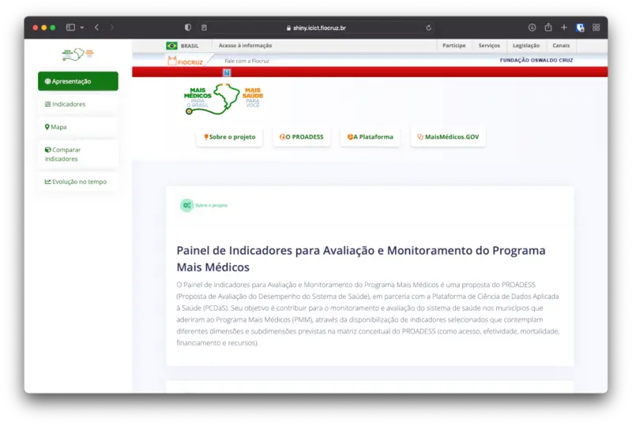

{fig-align="center"}

O "Projeto Mais Médicos" foi o primeiro projeto em que me envolvi na Fiocruz, por meio da iniciativa PCDaS. Fui responsável por desenvolver um painel de dados e coordenar uma equipe com outros assistentes de pesquisa.

O projeto tinha como objetivo apresentar dados sobre o programa federal "Mais Médicos", uma política pública de saúde que incentivou médicos a trabalhar em regiões menos desenvolvidas do Brasil e também contratou médicos estrangeiros de Cuba e de outros países para atuar nessas regiões.

O projeto foi descontinuado.
