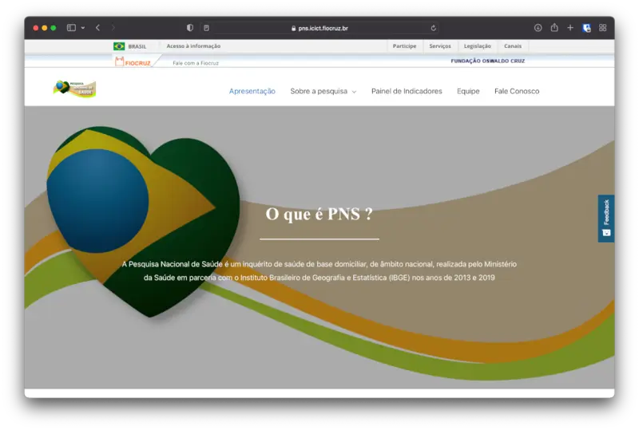

{fig-align="center"}

Este projeto é uma parceria entre o PCDaS e pesquisadores da Fiocruz e do IBGE. A PNS é uma pesquisa nacional sobre as condições de saúde da população, com duas edições: 2013 e 2019. Seus resultados cobrem aspectos importantes da saúde da população e envolvem técnicas especiais para amostras complexas.

Coordeno a equipe do PCDaS responsável por criar notebooks reprodutíveis sobre expansão amostral e por desenvolver e manter um site com documentação do projeto e painel de dados.

Endereço do site do projeto: https://www.pns.icict.fiocruz.br

Este trabalho é apoiado pelo Ministério da Saúde.
