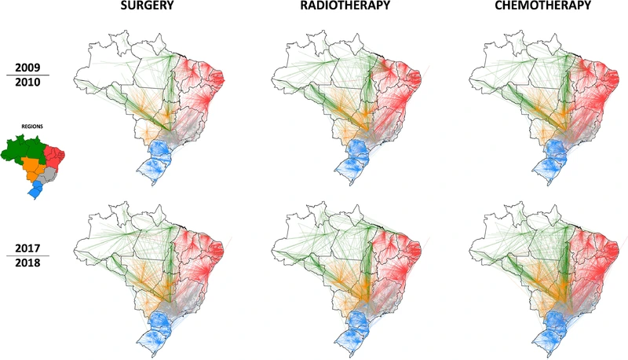

{fig-align="center"}

Este projeto foi uma parceria entre o PCDaS e o CDTS. O projeto estudou o fluxo intermunicipal de pacientes em tratamento de câncer no Brasil.

Fui responsável por tratar grandes bases de dados sobre internações e tratamentos e realizar análises de redes.

Este trabalho foi apoiado pelo Inova Fiocruz e resultou em um artigo publicado: http://dx.doi.org/10.1016/j.lana.2021.100153.
