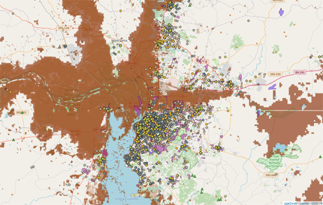

{fig-align="center" width="400"}

Saúde RS é um projeto de resposta rápida ao [desastre das enchentes no Rio Grande do Sul](https://pt.wikipedia.org/wiki/Enchentes_no_Rio_Grande_do_Sul_em_2024), ocorrido no Brasil em maio de 2024. O projeto apresenta mapas e fontes de dados sobre as enchentes, com ênfase no mapeamento de unidades de saúde em áreas de risco.

Acesso: <https://rfsaldanha.github.io/sauders>
