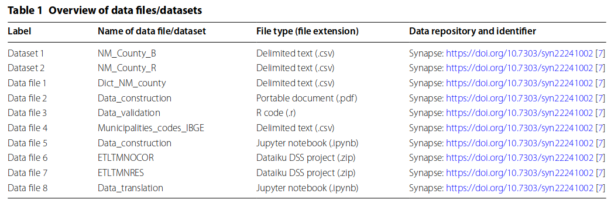

---
nocite: |
  @baroniNeonatalMortalityRates2021b
---

## Referência

::: {#refs}
:::

## Resumo

A mortalidade neonatal é um problema global de saúde pública, e os esforços para reduzir a mortalidade infantil estão entre os objetivos da Agenda 2030 para o Desenvolvimento Sustentável, lançada em 2015 pelas Nações Unidas. A disponibilidade de dados históricos sobre taxas de mortalidade neonatal (TMN) nos municípios brasileiros é essencial para avaliar tendências em níveis local, regional e nacional, identificando lacunas e territórios vulneráveis. Portanto, o objetivo deste artigo é oferecer uma base de dados integrada contendo dados mensais em uma série histórica de 1996 a 2017, com informações sobre todos os nascimentos, óbitos neonatais e TMN (total, componentes precoce e tardio), enriquecidas com informações relacionadas ao município.
