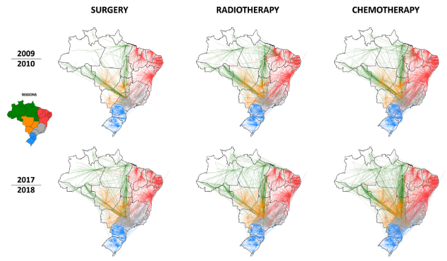

---
nocite: |
  @fonsecaGeographicAccessibilityCancer2022a
---

## Referência

::: {#refs}
:::

## Resumo

### Contexto

A acessibilidade geográfica aos serviços de saúde é um componente fundamental para alcançar a cobertura universal de saúde, compromisso central do Sistema Único de Saúde (SUS). Para pacientes com câncer, a baixa acessibilidade tem sido associada a tratamento inadequado, pior prognóstico e menor qualidade de vida.

### Métodos

Exploramos dados nacionais de saúde dos sistemas de informação do SUS e mapeamos a acessibilidade geográfica ao tratamento do câncer em dois períodos: 2009--2010 e 2017--2018. Aplicamos análise de redes sociais (ARS) para estimar rotas de deslocamento, fluxos e distâncias percorridas por pacientes com câncer para realizar tratamento cirúrgico, radioterápico e quimioterápico.

### Resultados

Foram analisados 12.751.728 procedimentos de tratamento. Em geral, mais da metade dos pacientes (49,2 a 60,7%) precisou se deslocar para fora do município de residência para tratamento, situação que não mudou ao longo do tempo. Foram observadas diferenças regionais marcantes, pois pacientes residentes nas regiões Norte e Centro-Oeste do país precisaram percorrer distâncias maiores (média ponderada de 296 a 870 km). Os polos de atenção oncológica e de atração foram identificados principalmente nas regiões Sudeste e Nordeste, com Barretos sendo o principal polo para todos os tipos de tratamento ao longo do período.

### Interpretação

Foram reveladas importantes disparidades regionais na acessibilidade ao tratamento do câncer no Brasil, sugerindo a necessidade de revisar a distribuição da atenção especializada no país. Os dados apresentados contribuem para pesquisas em andamento sobre a melhoria do acesso ao cuidado oncológico e podem servir de referência para outros países, oferecendo informações relevantes para avaliação, monitoramento e planejamento estratégico de serviços oncológicos e de saúde.

### Financiamento

Este trabalho foi financiado pela Fundação Oswaldo Cruz - Fiocruz (Inova - nº 8451635123 para BPF) e pelo Conselho Nacional de Desenvolvimento Científico e Tecnológico - CNPq (nº 407060/2018--9 para BPF); Coordenação de Aperfeiçoamento de Pessoal de Nível Superior - CAPES (bolsa para PCA, Código de Financiamento 001); e Instituto Nacional de Ciência e Tecnologia de Inovação em Doenças de Populações Negligenciadas (INCT-IDPN).
