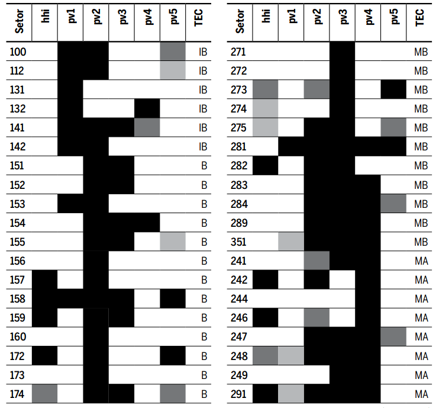

---
nocite: |
  @goncalvesCrescimentoEmpregoIndustrial2019a
---

## Referência

::: {#refs}
:::

## Resumo

O objetivo deste artigo é revisitar o debate sobre o grau de especialização e diversificação industrial e o crescimento do emprego industrial local no Brasil. É construída uma matriz de transbordamentos setoriais para verificar se setores agrupados por intensidade tecnológica influenciam o desempenho de grupos industriais desagregados. Técnicas de painel espacial são usadas para controlar efeitos locais não observados e possível dependência espacial no período de 1995 a 2014. Os resultados mostram que especializações em grupos industriais de baixa tecnologia estimulam vários outros grupos industriais, independentemente do nível de intensidade tecnológica. Os transbordamentos provenientes de indústrias de alta tecnologia são menos frequentes, embora também ocorram dependendo do grupo industrial considerado. Em geral, setores de maior e menor intensidade tecnológica prosperam na presença de externalidades MAR. Concluímos que o debate diversificação/especialização pode variar consideravelmente, exigindo políticas industriais e regionais específicas por segmento industrial.
