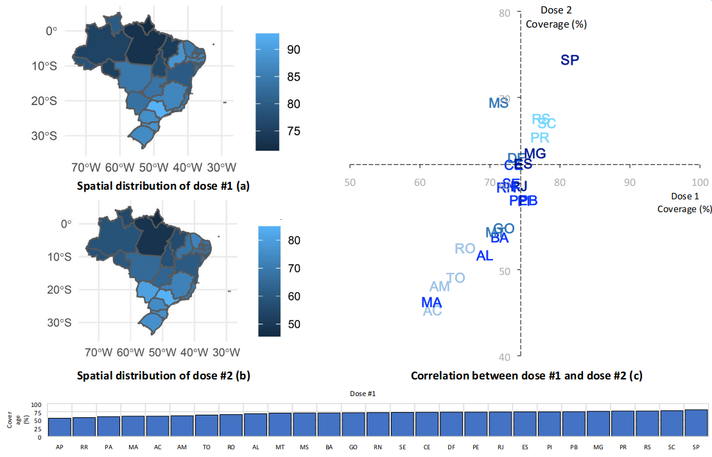

---
nocite: |
  @guimaraesHowOvercomeStagnation2022a
---

## Referência

::: {#refs}
:::

## Resumo

Contexto: Uma grande parcela da população ainda não iniciou a vacinação, e o aumento da cobertura nesse grupo é quase nulo. Métodos: Usamos análise de regressão segmentada para estimar tendências na curva de cobertura da primeira dose. Resultados: Houve desaceleração na aplicação das primeiras doses no Brasil a partir da semana epidemiológica 36 (variação percentual média \[APC\] de 0,83%, intervalo de confiança \[IC\] de 95%: 0,75-0,91%), com tendência próxima à estagnação. Conclusões: É importante desenvolver estratégias para ampliar o acesso aos postos de vacinação. Além disso, recomenda-se expandir a vacinação para crianças, aumentando assim a população elegível.
