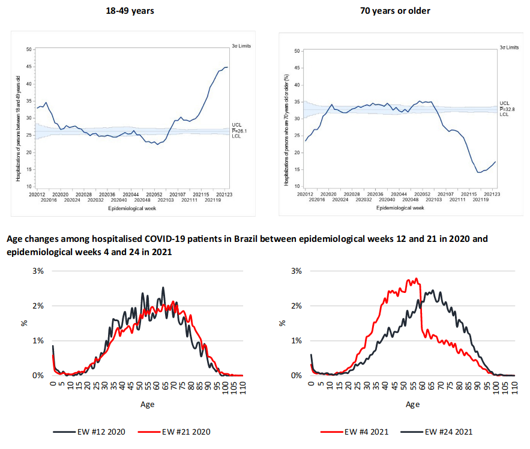

---
nocite: |
  @guimaraesIncreasingImpactCOVID192021b
---

## Referência

::: {#refs}
:::

## Resumo

### Objetivos

Preocupações sobre o impacto crescente da COVID-19 grave em indivíduos mais jovens no Brasil surgiram após uma onda recente e sincronizada de casos em todo o país. Esta comunicação analisa como as hospitalizações por COVID-19 mudaram nos grupos etários de 18--49 anos e ≥70 anos.

### Desenho do estudo

Estudo longitudinal baseado em dados secundários.

### Métodos

Foram usados dados do SIVEP-Gripe, uma base pública e de acesso aberto de registros de Síndrome Respiratória Aguda Grave (incluindo notificações de COVID-19). Gráficos de controle estatístico examinaram mudanças na magnitude e na variação de adultos mais jovens (18--49 anos) e idosos (≥70 anos) hospitalizados entre 15 de março de 2020 e 19 de junho de 2021.

### Resultados

Nas primeiras semanas da pandemia no Brasil, o número de hospitalizações por COVID-19 aumentou entre idosos, mas diminuiu entre adultos mais jovens. Posteriormente, as hospitalizações atingiram zonas de controle estatístico nas semanas epidemiológicas (SE) 19--48 de 2020 (SE 19-48/2020) e SE 03-05/2021 (18--49 anos, média = 26,1%; ≥70 anos, média = 32,8%). Entre a SE 49/2020 e a SE 02/2021, o número de hospitalizações de adultos mais jovens caiu para níveis abaixo do limite inferior de controle. Em contraste, o número de hospitalizações de idosos ultrapassou o limite superior das zonas de controle estatístico correspondentes. No entanto, a partir da SE 06/2021, os números de hospitalizações saíram das zonas de controle estatístico, com aumento das hospitalizações de adultos mais jovens, chegando a 44,9% na SE 24/2021, e redução das hospitalizações de idosos até a SE 19/2021 (14,1%), chegando a 17,3% na SE 24/2021.

### Conclusões

Observou-se aumento no número de hospitalizações por COVID-19 em adultos mais jovens a partir da SE 06/2021. Isso pode ser resultado do sucesso do programa de vacinação em idosos, inicialmente priorizados, e possivelmente de maior exposição de adultos mais jovens a variantes altamente transmissíveis da COVID-19, especialmente entre aqueles que precisaram trabalhar na ausência de proteção social (isto é, apoio financeiro governamental). As potenciais consequências das hospitalizações por COVID-19 em adultos mais jovens incluem redução da expectativa de vida da população e aumento do número de pessoas incapazes de realizar atividades diárias devido a condições pós-COVID-19.
