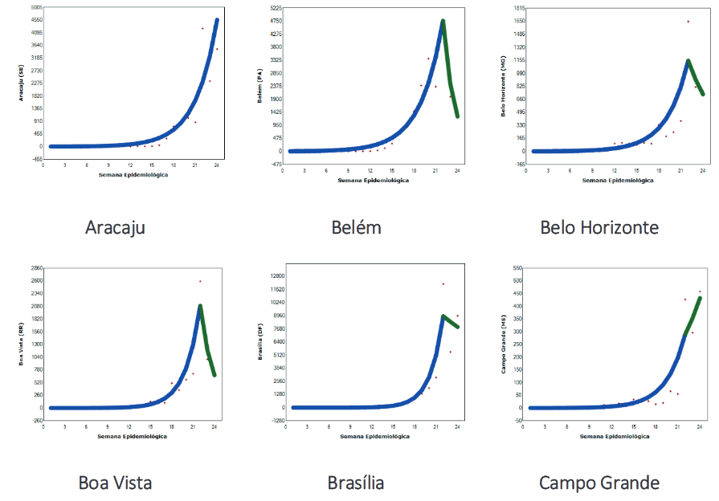

---
nocite: |
  @guimaraesItTimeTalk2020b
---

## Referência

::: {#refs}
:::

## Resumo

### Introdução

O monitoramento de infecções e mortes relacionadas à doença pelo coronavírus (COVID-19) no Brasil é controverso, com pressão crescente para flexibilizar medidas de distanciamento social. No entanto, não há evidências de uma queda sustentada e disseminada dos casos.

### Métodos

Usamos análise de regressão segmentada (joinpoint) para descrever o comportamento das infecções por COVID-19 nas capitais brasileiras.

### Resultados

Todas as capitais apresentaram aumento exponencial ou quase exponencial dos casos até maio. Em seguida, foi observada queda nos casos notificados em 20 cidades, mas essa queda foi significativa em apenas 8 (29,6%) e foi seguida por novo aumento em duas delas.

### Conclusões

É necessária cautela ao considerar a flexibilização das restrições.
