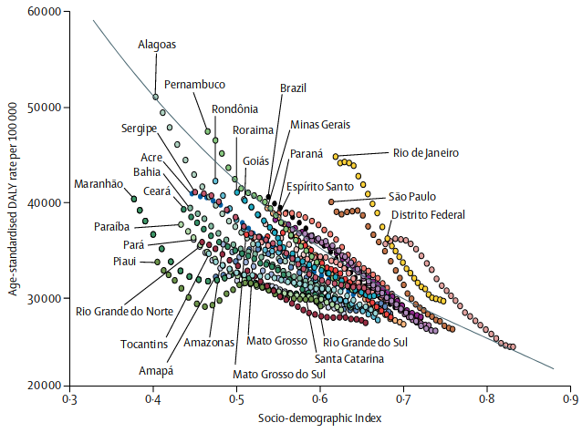

---
nocite: |
  @marinhoBurdenDiseaseBrazil2018
---

## Referência

::: {#refs}
:::

## Resumo

### Contexto

Mudanças políticas, econômicas e epidemiológicas no Brasil afetaram a saúde e o sistema de saúde. Usamos os resultados do Global Burden of Disease Study 2016 (GBD 2016) para compreender mudanças nos padrões de saúde e subsidiar respostas de políticas públicas.

### Métodos

Analisamos estimativas do GBD 2016 para esperança de vida ao nascer (EV), esperança de vida saudável (HALE), mortalidade por todas as causas e por causas específicas, anos de vida perdidos (YLLs), anos vividos com incapacidade (YLDs), anos de vida ajustados por incapacidade (DALYs) e fatores de risco para o Brasil, seus 26 estados e o Distrito Federal, de 1990 a 2016, comparando-as com estimativas nacionais de dez países de referência.

### Resultados

No país, a EV aumentou de 68,4 anos (intervalo de incerteza \[II\] de 95%: 68,0--68,9) em 1990 para 75,2 anos (74,7--75,7) em 2016, e a HALE aumentou de 59,8 anos (57,1--62,1) para 65,5 anos (62,5--68,0). As taxas de mortalidade padronizadas por idade por todas as causas diminuíram 34,0% (33,4--34,5), enquanto as taxas de DALY padronizadas por idade por todas as causas diminuíram 30,2% (27,7--32,8); a magnitude das reduções variou entre os estados. Em 2016, a doença isquêmica do coração foi a principal causa de YLLs padronizados por idade, seguida pela violência interpessoal. Dor lombar e cervical, doenças dos órgãos dos sentidos e doenças de pele foram as principais causas de YLDs em 1990 e 2016. Os principais fatores de risco que contribuíram para DALYs em 2016 foram uso de álcool e drogas, pressão arterial elevada e índice de massa corporal elevado.

### Interpretação

A saúde melhorou de 1990 a 2016, mas as melhorias e a carga de doença variaram entre os estados. Ocorreu no país uma transição epidemiológica em direção às doenças não transmissíveis e riscos relacionados, embora mais tardiamente em alguns estados, enquanto a violência interpessoal cresceu como preocupação de saúde. Gestores e formuladores de políticas podem usar esses resultados para enfrentar desigualdades em saúde.

### Financiamento

Bill & Melinda Gates Foundation e Ministério da Saúde do Brasil.
