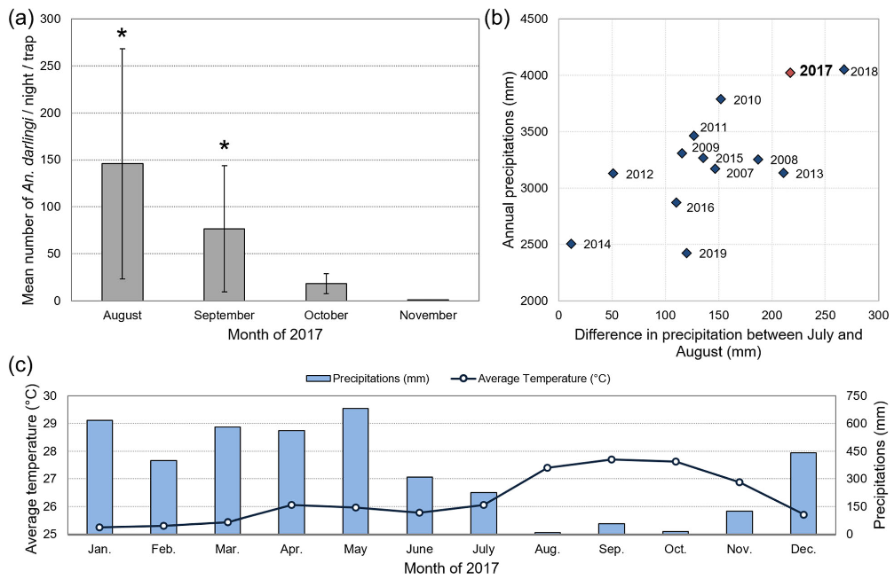

---
nocite: |
  @mosnierResurgenceRiskMalaria2020a
---

## Referência

::: {#refs}
:::

## Resumo

### Contexto

Em 2017, moradores da fronteira entre a Guiana Francesa e o Brasil foram afetados por um surto de malária causado principalmente por Plasmodium vivax (Pv). Embora os casos de malária tenham diminuído de forma constante entre 2005 e 2016 nessa região amazônica, observou-se uma ressurgência em 2017.

### Métodos

Foram realizadas duas investigações em diferentes escalas espaciais e níveis de detalhe da informação: (1) um estudo local na fronteira da Guiana Francesa, que permitiu investigação detalhada dos casos de malária tratados em um centro de saúde de uma aldeia local e das circunstâncias entomológicas no bairro mais afetado; e (2) um estudo regional e transfronteiriço, que permitiu explorar a dinâmica epidêmica espaço-temporal regional. O número e a localização dos casos de malária foram estimados usando os sistemas de vigilância francês e brasileiro.

### Resultados

No lado guianense da fronteira, em Saint-Georges de l'Oyapock, a taxa de ataque foi de 5,5% (n = 4000), chegando a 51,4% (n = 175) em um bairro indígena. Os achados entomológicos sugerem um pico de densidade de Anopheles darlingi em agosto e setembro. Duas fêmeas de An. darlingi (n = 1104, 0,18%) foram encontradas positivas para Pv durante esse pico. No mesmo período, dados agregados da vigilância passiva conduzida por centros de saúde de fronteira brasileiros e guianenses identificaram 1566 casos de infecção por Pv. A distribuição temporal no período de 2007--2018 apresentou padrões sazonais, com pico em novembro de 2017. Quatro agrupamentos foram identificados entre os perfis epidêmicos das localidades da área transfronteiriça. Todas as localidades dos dois primeiros agrupamentos eram brasileiras. A localização do primeiro agrupamento sugere início do surto em uma reserva indígena, com expansão posterior para bairros indígenas franceses e comunidades não indígenas.

### Conclusões

Os achados demonstram um potencial aumento dos casos de malária em uma área que, de outra forma, apresentava números em declínio. Trata-se de uma região transfronteiriça em que a mobilidade humana e populações remotas desafiam os programas de controle da malária. Esta investigação ilustra a importância da vigilância e da colaboração internacional em áreas de fronteira para o controle da malária, particularmente em aldeias indígenas e populações móveis.
