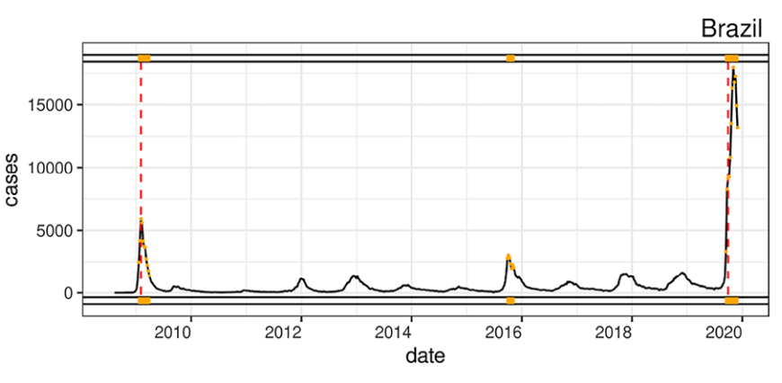

---
nocite: |
  @paixaoEstimationCOVID19UnderReporting2021a
---

## Referência

::: {#refs}
:::

## Resumo

Devido ao seu impacto, a COVID-19 tem mobilizado a comunidade acadêmica na busca por formas de cura, mitigação ou controle. Acredita-se que a subnotificação seja um fator relevante para determinar a taxa real de mortalidade e que, se não considerada, possa gerar desinformação significativa. Assim, este trabalho tem como objetivo estimar a subnotificação de casos e óbitos por COVID-19 nos estados brasileiros usando dados do InfoGripe. O InfoGripe acompanha notificações de Síndrome Respiratória Aguda Grave (SRAG). A metodologia baseia-se na combinação de análise de dados (métodos de detecção de eventos) e modelagem de séries temporais (conceitos de inércia e novidade) sobre casos hospitalizados de SRAG. A estimativa dos casos reais da doença, chamada de novidade, é calculada comparando a diferença nos casos de SRAG em 2020 (após a COVID-19) com o total de casos esperados nos anos recentes (2016--2019). Os casos esperados são derivados de uma média móvel exponencial sazonal. Os resultados mostram que as taxas de subnotificação variam significativamente entre os estados e que não há padrões gerais para estados de uma mesma região do Brasil. Minas Gerais e Mato Grosso apresentam as maiores taxas de subnotificação de casos. A taxa de subnotificação de óbitos é alta no Rio Grande do Sul e em Minas Gerais. Este trabalho se destaca pela combinação de análise de dados e modelagem de séries temporais. Nosso cálculo das taxas de subnotificação com base em SRAG é conservador e é melhor caracterizado para óbitos do que para casos.
