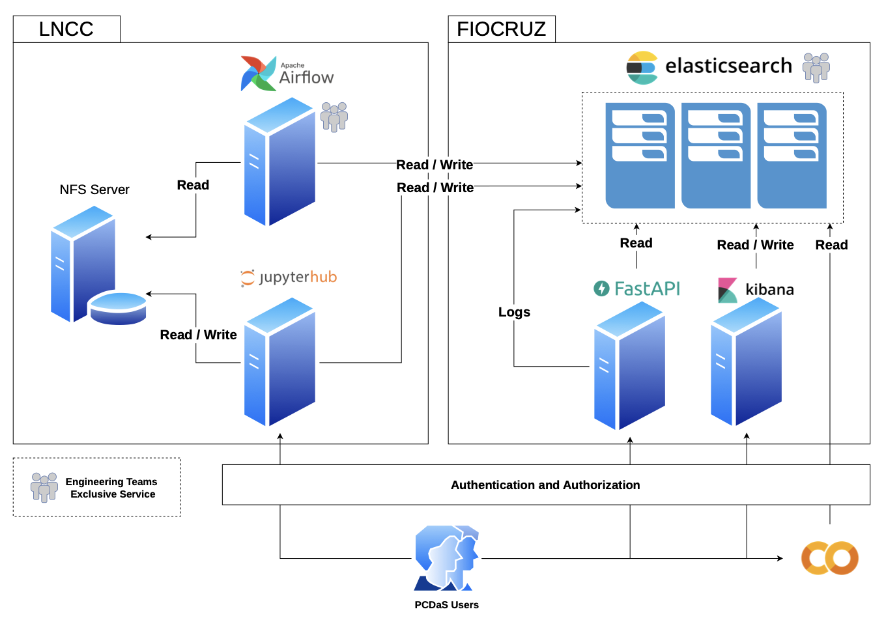

---
nocite: |
  @pedrosoDataSciencePlatform2023
---

## Referência

::: {#refs}
:::

A Plataforma de Ciência de Dados Aplicada à Saúde (PCDaS) é um projeto de pesquisa e desenvolvimento tecnológico que tem como objetivo desenvolver e aplicar novos métodos de análise de dados a dados de saúde pública. Ela preenche uma lacuna tecnológica entre a variedade de fontes de dados disponíveis em formatos legados e não padronizados e as necessidades e possibilidades atuais de aplicações de Ciência de Dados para consumir e explorar dados em benefício do Sistema Único de Saúde. A PCDaS oferece acesso democrático a bases e informações relacionadas à saúde, exigindo menos habilidades tecnológicas de seus usuários e mantendo uma pilha tecnológica continuamente atualizada. Como ecossistema de dados, nosso principal objetivo é oferecer acesso remoto e seguro a dados de saúde, ferramentas tecnológicas e uma infraestrutura robusta da plataforma para processar e analisar grandes volumes de dados que geralmente demandam poder computacional indisponível para pesquisadores. A infraestrutura é composta por servidores locais e em nuvem, multi-região, preparados para lidar com análises pesadas de Big Data a partir de qualquer lugar e por múltiplos usuários simultaneamente. Oferecer acesso remoto e seguro a bases de dados de saúde, em sua forma original ou processada, é um avanço cotidiano para pesquisadores em saúde pública. Saber que há um lugar onde é possível acessar dados integrados em formato padronizado torna o processo de pesquisa muito mais manejável. Para garantir qualidade, nossas equipes de engenharia e governança de dados processam essas fontes seguindo um padrão ouro baseado em tabelas cruzadas fornecidas pelo Ministério da Saúde (o sistema TabNET) e decodificando as variáveis originais em nomes significativos fornecidos pelas fontes. É muito relevante destacar a documentação abrangente de metadados, atributos e do processo ETL (Extract, Transform, Load) para as bases de dados. Cada parte dessas etapas é descrita em detalhes no site da PCDaS, garantindo compreensão e reprodutibilidade do processo. Esses recursos asseguram que usuários da PCDaS possam aproveitar efetivamente os recursos e capacidades da plataforma, permitindo que conduzam pesquisas, realizem análises de dados e colaborem em um ambiente seguro e de apoio para contribuir com o Sistema Único de Saúde.
