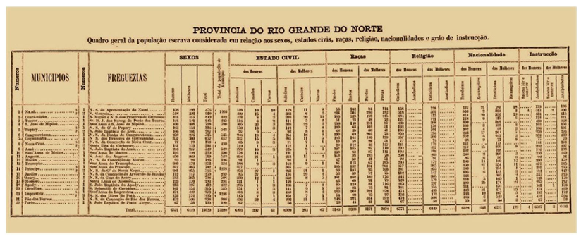

---
nocite: |
  @saldanhaCienciaDadosBig2021a
---

## Referência

::: {#refs}
:::

## Resumo

### Contexto

O termo big data já não é novidade no ambiente acadêmico e tornou-se mais comum em publicações científicas e editais de pesquisa, levando a uma profunda revisão da forma como a ciência é produzida e ensinada.

### Objetivo

Refletir sobre as possíveis mudanças que a ciência de dados pode induzir em estudos populacionais e de saúde.

### Método

Para fomentar esse debate, artigos científicos selecionados do campo de big data em saúde e demografia foram contrastados com livros e outras produções científicas.

### Resultados

Argumenta-se que o volume não é a característica mais promissora do big data para estudos populacionais e de saúde, mas sim a complexidade dos dados e as possibilidades de integração com estudos tradicionais por meio de equipes interdisciplinares.

### Conclusão

Em estudos populacionais e de saúde, as possibilidades de integração entre métodos novos e tradicionais são amplas e incluem novas ferramentas para análise, monitoramento, predição de eventos (casos) e processos saúde-doença na população, bem como para o estudo de determinantes sociodemográficos e ambientais.
