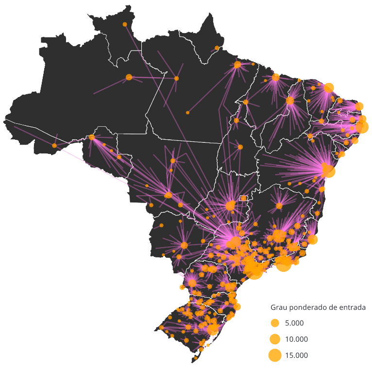

---
nocite: |
  @saldanhaEstudoAnaliseRede2019
---

## Referência

::: {#refs}
:::

## Resumo

Este estudo tem como objetivo analisar o fluxo de pacientes com câncer de mama atendidos fora de seu município de residência, com base em internações hospitalares, quimioterapia e radioterapia no Sistema Único de Saúde (SUS) entre 2014 e 2016. Foi utilizada análise de redes, considerando os municípios de residência e de tratamento como nós em um grafo, compondo um "estudo de rede organizacional do sistema de saúde". Além disso, foram estimadas distâncias rodoviárias e tempo de deslocamento pela melhor rota viável segundo o projeto OpenStreetMap. Segundo os resultados, 51,34% das pacientes com câncer de mama no Brasil foram atendidas fora de seu município de residência, seguindo fluxos regionalizados que respeitam as fronteiras estaduais, geralmente em direção à capital do estado ou a outras grandes cidades. Os resultados também apontam exceções específicas, em que alguns municípios ocupam posições de destaque que extrapolam as fronteiras estaduais. A mediana do tempo de deslocamento entre o município de residência e o município de atendimento foi de quase 3 horas, e 75% dos deslocamentos totalizaram 324 km para quimioterapia, 287 km para radioterapia e 282 km para internações. Esses resultados indicam dificuldades de acesso aos serviços oncológicos, potencialmente agravando a experiência de adoecimento por câncer em termos de impacto sobre os indivíduos e suas famílias.
