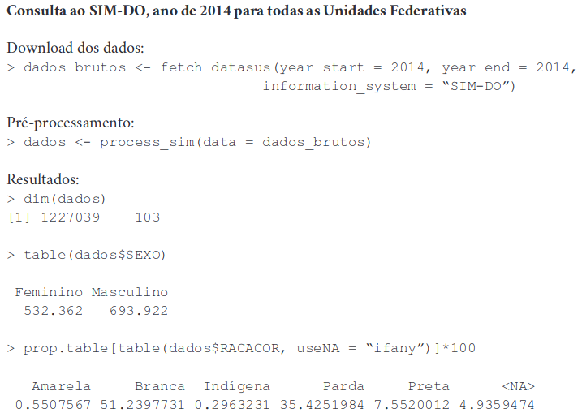

---
nocite: |
  @saldanhaMicrodatasusPacotePara2019
---

## Referência

::: {#refs}
:::

## Resumo

Este estudo teve como objetivo desenvolver um algoritmo para download e pré-processamento de microdados fornecidos pelo Departamento de Informática do SUS (DATASUS) para diversos sistemas de informação em saúde, usando a linguagem de programação estatística R. O pacote permite baixar e pré-processar dados de diferentes sistemas de informação em saúde, incluindo a rotulação de campos categóricos nos arquivos. A função de download foi capaz de acessar diretamente e reduzir o trabalho necessário para selecionar arquivos de microdados e variáveis no DATASUS, enquanto a função de pré-processamento permitiu a codificação automática de diversos campos categóricos. Assim, o pacote possibilita um fluxo de trabalho contínuo no mesmo programa, em que o algoritmo permite baixar e pré-processar dados e outros pacotes em R permitem analisar dados dos sistemas de informação em saúde do Sistema Único de Saúde (SUS).
