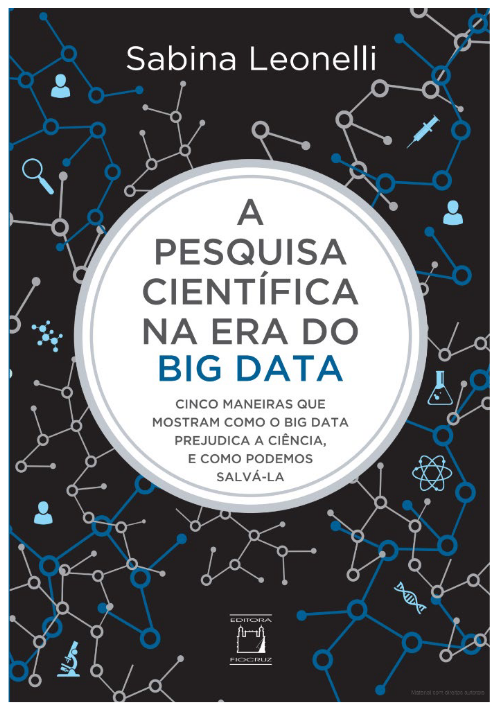

---
nocite: |
  @saldanhaPesquisaCientificaNa2022
---

## Referência

::: {#refs}
:::

## Resumo

O livro *A pesquisa científica na era do Big Data: cinco maneiras que mostram como o Big Data prejudica a ciência, e como podemos salvá-la*, de Sabina Leonelli, publicado em 2022 pela Editora Fiocruz, explora em seus capítulos as definições de Big Data e seus impactos negativos na pesquisa científica. Em seguida, a autora apresenta uma nova abordagem epistemológica para o Big Data e, por fim, um conjunto de propostas para desenvolver uma boa pesquisa científica. A revisão da literatura e a atualização de definições, assim como as reflexões e perguntas importantes para o uso consciente do Big Data na pesquisa científica, tornam a obra uma contribuição relevante para a biblioteca de pesquisadores da informação e comunicação em saúde.
