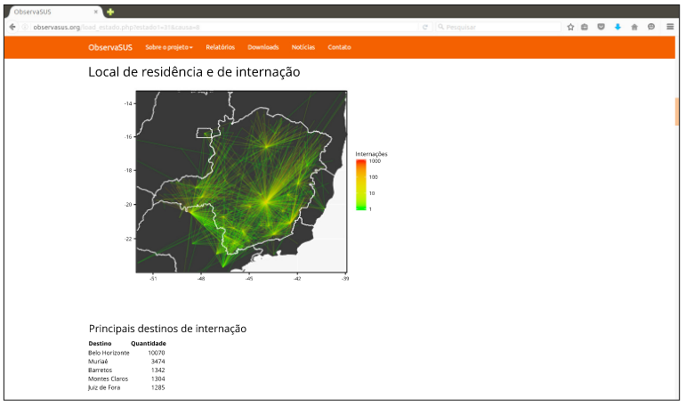

---
nocite: |
  @saldanhaPropostaUmObservatorio2017
---

## Referência

::: {#refs}
:::

## Resumo

Após a criação do Sistema Único de Saúde (SUS), o Departamento de Informática do SUS (DATASUS) foi criado em 1991 com o objetivo de organizar sistemas de informação e bases de dados em saúde. O acesso e a visualização de dados on-line são livres e abertos, por meio de tabelas e gráficos de dados agregados e acesso a dados brutos. No entanto, a forma atual de acesso aos dados não atende plenamente às demandas de gestores do sistema de saúde e de outros usuários por uma ferramenta flexível e amigável, capaz de lidar com diversas questões relevantes de saúde na busca por conhecimento e na tomada de decisão. Propomos um sistema auxiliar capaz de gerar relatórios mensais sintéticos, de fácil acesso e compreensão, com ênfase na visualização das informações por meio de gráficos e mapas.
