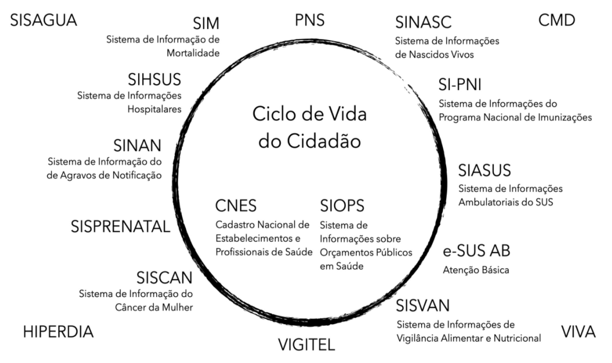

---
nocite: |
  @saldanhaSIS2025
---

## Referência

::: {#refs}
:::

## Resumo

Este e-book oferece uma visão abrangente e sistemática dos principais Sistemas de Informação em Saúde (SIS) usados no Brasil, detalhando seu desenvolvimento histórico, estrutura organizacional, dados disponíveis, principais aplicações e indicadores centrais. A obra contextualiza a evolução dos sistemas de informação em saúde no cenário sanitário brasileiro e apresenta descrições aprofundadas dos principais sistemas nacionais, incluindo mortalidade (SIM), nascidos vivos (SINASC), internações hospitalares (SIH), atendimento ambulatorial (SIA), doenças de notificação compulsória (SINAN), estabelecimentos de saúde (CNES), orçamentos públicos em saúde (SIOPS), vigilância da qualidade da água (SISAGUA), atenção primária (SISAB) e imunização nacional (SI-PNI). Cada capítulo esclarece a finalidade, os elementos de dados e os usos analíticos desses sistemas, permitindo que os leitores compreendam como eventos e serviços de saúde são registrados, monitorados e interpretados para vigilância epidemiológica, planejamento em saúde e formulação de políticas. Apêndices suplementares fornecem materiais de referência essenciais, como classificações da CID, esquemas de codificação municipal, estimativas populacionais e sistemas adicionais de vigilância, ampliando a utilidade da obra para pesquisadores, profissionais de saúde pública e formuladores de políticas. De autoria de Raphael de Freitas Saldanha, este e-book serve tanto como guia introdutório quanto como referência prática para trabalhar com a diversa infraestrutura brasileira de informação em saúde.
