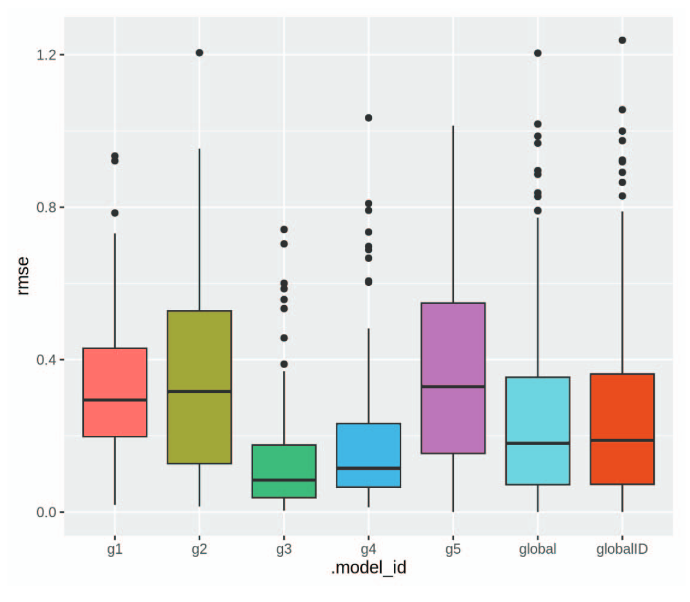

---
nocite: |
  @saldanhaSubsetModelsMultivariate2024
---

## Referência

::: {#refs}
:::

## Resumo

Séries temporais multivariadas têm ampla aplicação em conjunto com metodologias de aprendizado de máquina para previsão de cenários em diversos domínios. No entanto, certos domínios apresentam complexidades e diversidades inerentes, que prejudicam a eficácia preditiva de modelos globais. Este estudo em andamento apresenta um Subset Modeling Framework projetado para reconhecer a diversidade inerente ao espaço multivariado de um domínio. Avaliações comparativas entre modelos de subconjuntos e modelos globais são conduzidas em termos de desempenho, revelando achados promissores e sugerindo potencial para exploração e refinamento adicionais deste novo arcabouço.
