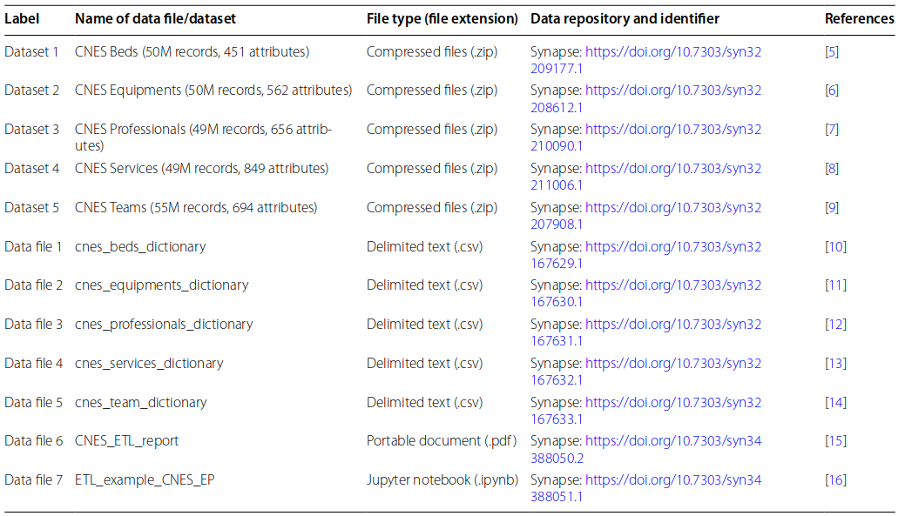

---
nocite: |
  @sallesComprehensiveIntegratedDataset2023a
---

## Referência

::: {#refs}
:::

## Resumo

### Objetivos

O Cadastro Nacional de Estabelecimentos de Saúde é um sistema que registra todos os estabelecimentos de saúde no Brasil, com informações sobre capacidade instalada e força de trabalho em saúde, considerando sua natureza pública ou privada. Apesar de estar publicamente disponível, só pode ser acessado em tabelas separadas e desconectadas, com diferentes unidades primárias de análise. O objetivo é oferecer uma base de dados interoperável contendo dados mensais de 2005 a 2021 com informações sobre estabelecimentos de saúde, incluindo recursos físicos e humanos, serviços e equipes, enriquecidas com informações municipais.

### Descrição dos dados

Base de dados com informações históricas e geográficas para cada estabelecimento de saúde no Brasil. É composta por 5 tabelas distintas, organizadas segundo combinações de tempo, espaço e tipos de recursos, serviços e equipes. Essa base abre várias possibilidades de temas de pesquisa, desde estudos de caso em um único estabelecimento e período, análise de um grupo de estabelecimentos com características de interesse, até estudos mais amplos usando a base completa e dados agregados por município. Além disso, o fato de haver uma linha para cada estabelecimento/mês/ano facilita a integração com outras bases do sistema de saúde brasileiro. Além de ser um potencial objeto de estudo na área da saúde, a base também é conveniente para ciência de dados, especialmente em estudos focados em séries temporais.
