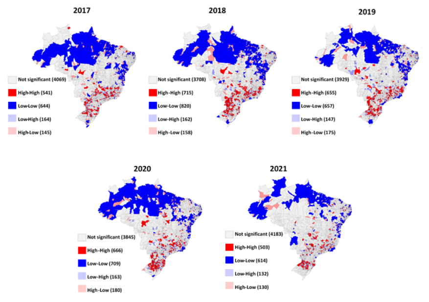

---
nocite: |
  @silvaTemporalSpatialDistribution2022
---

## Referência

::: {#refs}
:::

## Resumo

Contexto: A baixa cobertura vacinal contra poliomielite pode resultar na disseminação do Poliovirus para áreas livres de circulação viral. Este estudo analisou as tendências temporais e a distribuição espacial da cobertura vacinal contra poliomielite em crianças menores de cinco anos no Brasil, entre 2011 e 2021. Métodos: Trata-se de um estudo ecológico de séries temporais (2011 a 2021), com coberturas vacinais anuais contra poliomielite extraídas do Sistema de Informação do Programa Nacional de Imunizações para regiões dos 27 estados brasileiros. Foram calculadas as reduções percentuais da cobertura vacinal no Brasil e nas regiões. Modelos de regressão de Prais-Winsten foram usados para analisar séries temporais para regiões e estados, e a análise espacial identificou a distribuição de agrupamentos (alto-alto; baixo-baixo; alto-baixo e baixo-alto) das coberturas vacinais nos municípios brasileiros, usando nível de significância de 5%. Resultados: De 2011 a 2021, a cobertura das vacinas contra poliomielite diminuiu 46,1%. Observou-se aumento progressivo de agrupamentos com baixas coberturas vacinais (136 municípios brasileiros baixo-baixo em 2011 contra 614 em 2021), principalmente nas regiões Norte e Nordeste do país. Houve tendência de queda das coberturas vacinais em 8 dos 27 estados (p ≤ 0,05). Conclusões: A redução da cobertura vacinal contra poliomielite, observada nas regiões Norte e Nordeste do Brasil, pode favorecer a disseminação do Poliovirus. Portanto, estratégias de vacinação devem ser priorizadas para crianças residentes em áreas com quedas acentuadas e recorrentes das coberturas vacinais, incluindo viajantes, migrantes e refugiados.
