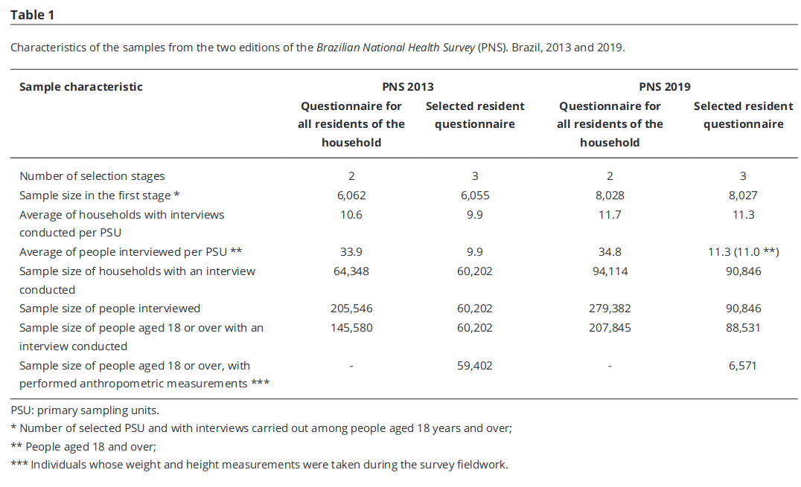

---
nocite: |
  @souzajuniorComparisonSamplingDesigns2022b
---

## Referência

::: {#refs}
:::

## Resumo

Nosso objetivo é descrever as diferenças nos planos amostrais das duas edições da Pesquisa Nacional de Saúde (PNS 2013 e 2019) e avaliar como as mudanças afetaram o coeficiente de variação (CV) e o efeito do desenho (Deff) de alguns indicadores estimados. Variáveis de diferentes partes do questionário foram analisadas para abranger proporções com diferentes magnitudes. A prevalência de obesidade foi incluída na análise porque a medição antropométrica na pesquisa de 2019 foi realizada em uma subamostra. O valor da estimativa pontual, o CV e o Deff foram calculados para cada indicador, considerando a estratificação das unidades primárias de amostragem, a ponderação das unidades amostrais e o efeito de conglomerado. O CV e o Deff foram menores nas estimativas de 2019 para a maioria dos indicadores. Em relação aos indicadores do questionário de todos os moradores do domicílio, os Deffs foram elevados e alcançaram valores superiores a 18 para posse de plano de saúde. Quanto aos indicadores do questionário individual, para a prevalência de obesidade, o Deff variou de 2,7 a 4,2 em 2013 e de 2,7 a 10,2 em 2019. A prevalência de hipertensão e diabetes por Unidade da Federação apresentou maior CV e menor Deff. A ampliação do tamanho da amostra para atender a diversos objetivos de saúde e o alto Deff são desafios importantes para o desenvolvimento de inquéritos nacionais probabilísticos de base domiciliar. Novas estratégias de amostragem probabilística devem ser consideradas para reduzir custos e efeitos de conglomerado.
