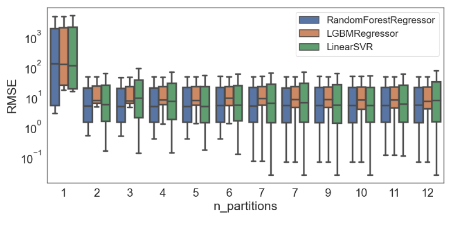

---
nocite: |
  @victor2023
---

## Referência

::: {#refs}
:::

## Resumo

O sucesso de sistemas de aprendizado de máquina (ML) depende da disponibilidade, volume e qualidade dos dados, além de recursos computacionais eficientes. Um desafio nesse contexto é reduzir custos computacionais mantendo uma acurácia adequada dos modelos. Este artigo apresenta um arcabouço para enfrentar esse desafio. A ideia é identificar "subdomínios" no espaço de entrada e treinar modelos locais que produzam melhores predições para amostras daquele subdomínio específico, em vez de treinar um único modelo global com a base completa. Avaliamos experimentalmente nossa abordagem em duas bases de dados reais. Nossos resultados indicam que a modelagem por subconjuntos (i) melhora o desempenho preditivo em comparação com um único modelo global e (ii) permite treinamento eficiente em termos de dados.
