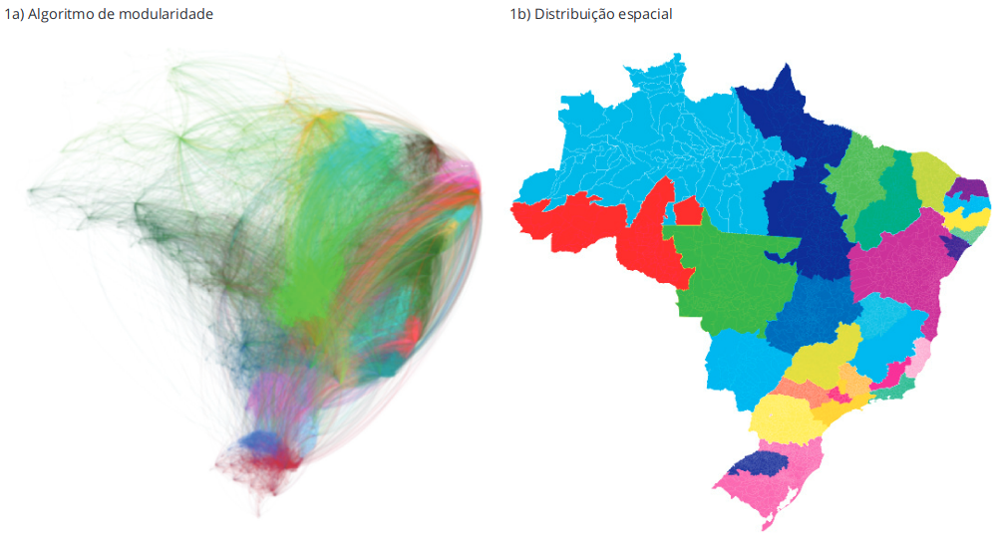

---
nocite: |
  @xavierRegioesSaudeNo2019
---

## Referência

::: {#refs}
:::

## Resumo

Este estudo abordou a regionalização em saúde em várias escalas espaciais com base no fluxo de pacientes. O artigo analisou dados por meio de relacionamento de bases sobre origem e destino das internações em nível municipal no Brasil em 2016. A análise baseia-se na teoria dos grafos e usa um algoritmo de modularidade que busca agrupar municípios em comunidades com grande número de interligações. O algoritmo otimiza o número de internações e altas hospitalares, levando em conta o fluxo de pacientes. Os resultados são apresentados considerando diferentes estruturas político-administrativas espaciais. Considerando o fluxo de pacientes sem restrições espaciais, foram criadas 29 comunidades no país, em comparação com 64 comunidades quando os limites das grandes regiões geográficas foram respeitados, e 164 quando considerados apenas os fluxos de pacientes dentro dos respectivos estados. Os resultados mostram a importância de regiões historicamente constituídas, ignorando fronteiras administrativas formais, para implementar o acesso aos serviços de saúde. Também revelam aderência a limites administrativos em muitos estados do Brasil, demonstrando a importância dessa escala espacial no contexto do acesso às internações hospitalares. A metodologia oferece contribuições relevantes para o planejamento regional em saúde.
