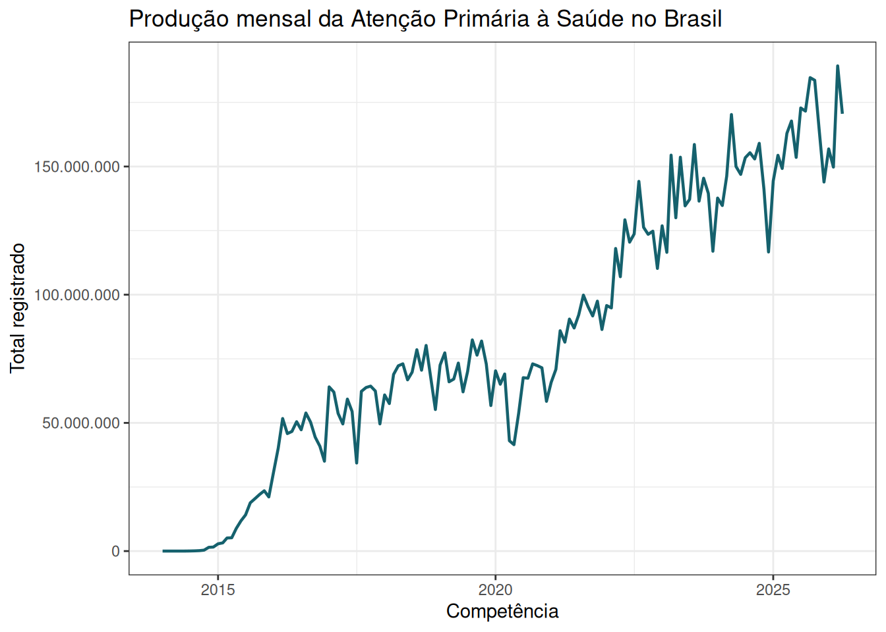
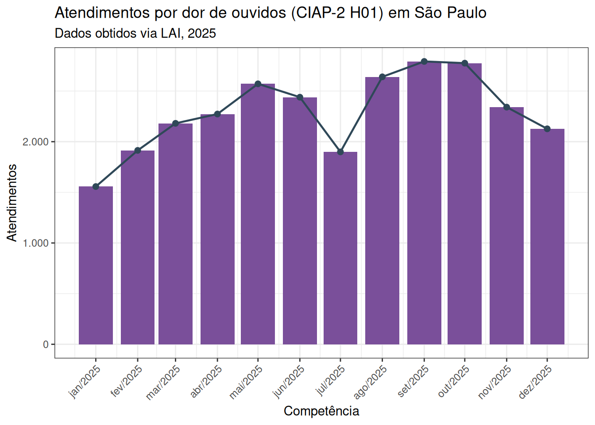
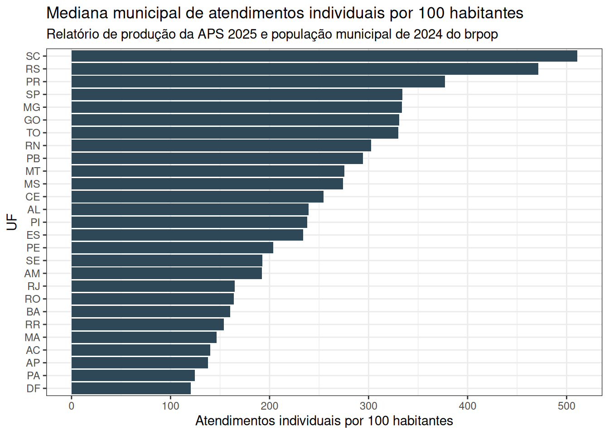

## Objetivo da conversa

::: big
Mostrar como transformar os registros agregados do SISAB em uma base aberta, auditável e útil para pesquisa, gestão e monitoramento da Atenção Primária à Saúde.
:::

Em 20 minutos:

1.  o que o SISAB registra;
2.  por que o acesso ainda é difícil;
3.  como os dados foram coletados e organizados;
4.  como acessar, analisar e interpretar os resultados.

::: notes
Abrir dizendo que a apresentação é sobre infraestrutura de dados, não apenas sobre uma base específica. A ideia central é reduzir o trabalho manual e permitir análises reprodutíveis da APS municipal.
:::

## Por que falar de SISAB?

::: quote
A APS é a principal porta de entrada do SUS, mas seus dados ainda são pouco usados na escala e na granularidade que poderiam.
:::

O SISAB/SIAPS reúne informações sobre:

:::::: threecols
::: colbox
**Atendimentos e visitas**\
produção registrada por equipes e serviços.
:::

::: colbox
**Procedimentos**\
ações realizadas na rotina da APS.
:::

::: colbox
**Problemas e condições**\
motivos de consulta, diagnósticos e condições avaliadas.
:::
::::::

::: notes
Enfatizar que o valor do SISAB está na combinação entre abrangência nacional, periodicidade mensal e escala municipal. Ao mesmo tempo, os dados são registros administrativos e dependem da prática local de registro.
:::

## O problema de acesso

::::: twocols
::: left
**Transparência ativa**

-   relatórios públicos no site do SISAB;
-   consultas por competência, município e categoria;
-   úteis para olhar casos pontuais;
-   pouco práticos para baixar séries longas.
:::

::: right
**Transparência passiva**

-   pedidos via LAI;
-   necessária para contagens por CID-10 e CIAP-2;
-   respostas podem ter formatos diferentes;
-   exige tratamento de proveniência.
:::
:::::

::: callout
O desafio é transformar relatórios e respostas administrativas em arquivos tabulares consistentes, versionáveis e reutilizáveis.
:::

::: notes
Explicar a diferença: transparência ativa é o que já está publicado; transparência passiva é o que precisa ser pedido. O objetivo é aproximar as duas em uma base integrada.
:::

## O que foi construído

::: timeline
**1. Coleta automatizada dos relatórios públicos**\
Produção, procedimentos e problemas/condições avaliadas por município, competência, faixa etária e sexo.

**2. Processamento de respostas via LAI**\
Atendimentos mensais por município, tipo de código, CID-10 ou CIAP-2, código e quantidade.

**3. Exportação em formatos abertos**\
Arquivos anuais em CSV compactado e Parquet.

**4. Publicação no Zenodo**\
Depósitos organizados por ano ou período, com DOI e arquivos reutilizáveis.
:::

::: notes
Dar a mensagem de arquitetura: cada etapa deixa rastros, preserva contexto e produz um arquivo que outra pessoa consegue baixar e analisar sem repetir a coleta original.
:::

## Duas fontes, duas estratégias

| Fonte | O que entra | Estratégia |
|------------------------|------------------------|------------------------|
| Relatórios públicos do SISAB | produção, procedimentos, problemas e condições avaliadas | raspagem automatizada das consultas municipais mensais |
| Lei de Acesso à Informação | atendimentos por CID-10 e CIAP-2 | padronização de respostas, resolução de sobreposições e preservação de proveniência |

::: callout
As duas fontes não competem: elas se complementam. Uma mostra a produção pública agregada; a outra abre uma camada diagnóstica ainda ausente da transparência ativa.
:::

::: notes
Apontar que CID e CIAP são especialmente importantes para perguntas epidemiológicas e de organização do cuidado, mas precisam ser interpretados como registro assistencial, não como incidência direta.
:::

## Repositórios do fluxo

::::: twocols
::: left
**sisab_scrapper**

-   coleta relatórios públicos;
-   itera competências, municípios, sexo e faixa etária;
-   exporta bases anuais;
-   foco em produção, procedimentos e condições avaliadas.

[github.com/rfsaldanha/sisab_scrapper](https://github.com/rfsaldanha/sisab_scrapper)
:::

::: right
**sisab_lai**

-   processa arquivos recebidos por LAI;
-   padroniza diferenças de esquema;
-   resolve sobreposições entre pedidos;
-   mantém informações de pedido e arquivo-fonte.

[github.com/rfsaldanha/sisab_lai](https://github.com/rfsaldanha/sisab_lai)
:::
:::::

::: notes
Este slide é para mostrar que não é uma planilha isolada. É um fluxo de coleta e curadoria que pode ser auditado e melhorado.
:::

## Estrutura dos arquivos

:::::: threecols
::: colbox
**Chaves territoriais**\
`uf`, `ibge`, `municipio` ou `co_municipio_ibge`
:::

::: colbox
**Tempo**\
`competencia` mensal, com arquivos organizados por ano
:::

::: colbox
**Medidas**\
`valor` nos relatórios públicos ou `qt_atendimentos` nos dados LAI
:::
::::::

Nos relatórios públicos, a estrutura típica inclui `competencia`, `uf`, `ibge`, `municipio`, `faixa_etaria`, `sexo`, categoria do relatório e `valor`.

Nos dados via LAI, a estrutura central é município, competência, `tp_codigo`, `codigo` e quantidade de atendimentos.

::: notes
Mostrar que as bases foram desenhadas para serem combinadas em R, Python, DuckDB, Arrow, bancos analíticos ou ferramentas de BI.
:::

## Cobertura publicada

| Período | Conteúdo principal |
|------------------------------------|------------------------------------|
| 2014-2016 | produção, procedimentos e condições avaliadas do SISAB público |
| 2017-2025 | SISAB público e atendimentos CID/CIAP via LAI |
| 2026-01 a 2026-04 | SISAB público e atendimentos CID/CIAP via LAI |

Todos os depósitos estão publicados no Zenodo e listados na página:

::: big
[rfsaldanha.github.io/data-projects/dados-aps.html](../data-projects/dados-aps.html)
:::

::: notes
Evitar gastar tempo lendo DOIs um por um. O ponto é que há continuidade temporal e que os depósitos foram separados por ano para facilitar download e versionamento.
:::

## Exemplo 1: produção mensal

{fig-alt="Série temporal da produção mensal da Atenção Primária à Saúde no Brasil"}

::: callout
Uma série mensal permite detectar sazonalidade, rupturas e mudanças no padrão de registro da APS.
:::

::: notes
Usar este slide para falar de séries nacionais mensais: sazonalidade, rupturas, mudanças de registro e possibilidades de comparação antes/depois. Reforçar que o gráfico é uma porta de entrada, não uma conclusão causal.
:::

## Exemplo 2: CID e CIAP por LAI

{fig-alt="Atendimentos por dor de ouvidos, CIAP-2 H01, em São Paulo em 2025"}

::: callout
Os dados por CID-10 e CIAP-2 aproximam a análise da clínica e do motivo de consulta, desde que lidos como registros administrativos.
:::

::: notes
Explicar o exemplo: CIAP-2 H01, dor de ouvidos, município de São Paulo em 2025. O objetivo é mostrar a granularidade possível, não discutir especificamente otalgia.
:::

## Exemplo 3: intensidade de registro

{fig-alt="Mediana municipal de atendimentos individuais por 100 habitantes por UF"}

::: callout
A taxa por 100 habitantes ajuda a comparar intensidade de registro, mas não deve ser lida automaticamente como acesso, cobertura ou qualidade.
:::

::: notes
Apresentar a taxa de atendimentos individuais por 100 habitantes como indicador indireto de intensidade de registro no e-SUS AB. Dizer explicitamente que não mede cobertura assistencial nem adesão formal.
:::

## Que decisões podem ser apoiadas?

::::::: cards
::: card
**Monitorar a produção**\
Identificar meses atípicos, quedas abruptas, retomadas e sazonalidades.
:::

::: card
**Auditar o registro**\
Localizar municípios com ausência, saltos ou padrões incompatíveis com a série histórica.
:::

::: card
**Planejar linhas de cuidado**\
Observar motivos de consulta, condições acompanhadas e procedimentos registrados.
:::

::: card
**Comparar territórios**\
Apoiar análises por município, UF, faixa etária, sexo e intensidade de registro.
:::
:::::::

::: notes
Este é o slide para aproximar gestores, pesquisadores e pessoas de dados. Cada pergunta pode virar uma análise, painel, boletim ou auditoria local.
:::

## O que estes dados não respondem sozinhos?

::: quote
Registro administrativo não é sinônimo automático de acesso, cobertura, incidência ou qualidade do cuidado.
:::

:::::: threecols
::: colbox
**Não mede sozinho acesso**\
Uma baixa contagem pode ser baixa demanda, baixa oferta, falha de registro ou combinação disso.
:::

::: colbox
**Não mede sozinho incidência**\
CID-10 e CIAP-2 indicam registros de atendimento, não necessariamente ocorrência real na população.
:::

::: colbox
**Não mede sozinho qualidade**\
Mais registros podem indicar maior atividade, melhor registro ou mudanças operacionais.
:::
::::::

::: notes
Este slide deve ser dito com calma. Ele protege a análise contra leituras simplistas e reforça que a base deve ser combinada com contexto local, metadados e outras fontes.
:::

## Como acessar em R

``` r
library(arrow)
library(dplyr)
library(zendown)

arquivo <- zen_file(
  deposit_id = 20597086,
  file_name = "sisab_saude_producao_2025.parquet"
)

producao_2025 <- read_parquet(arquivo)

producao_2025 |>
  group_by(tipo_producao) |>
  summarise(total = sum(valor, na.rm = TRUE), .groups = "drop") |>
  arrange(desc(total))
```

::: notes
Falar que Parquet permite leitura eficiente e combina bem com Arrow, DuckDB e fluxos analíticos. O pacote zendown simplifica o acesso aos arquivos no Zenodo.
:::

## Boas práticas de uso

::::: twocols
::: left
**Antes da análise**

-   conferir período e fonte;
-   identificar filtros aplicados;
-   observar mudanças de sistema e registro;
-   manter o DOI e a versão do depósito.
:::

::: right
**Durante a interpretação**

-   distinguir produção registrada de demanda real;
-   tratar zeros e ausências com cuidado;
-   comparar municípios com contexto;
-   documentar decisões de limpeza.
:::
:::::

::: notes
Este slide é um freio saudável. Dados administrativos são poderosos, mas não falam sozinhos. A interpretação precisa combinar metadados, conhecimento local e cautela.
:::

## Limitações

::: quote
O SISAB mede registros enviados ao sistema. Isso é próximo da realidade da APS, mas não é a própria realidade.
:::

Pontos de atenção:

-   mudanças nas práticas de registro e envio;
-   cobertura e maturidade distintas entre municípios;
-   diferenças entre conceitos de produção, atendimento, procedimento e condição avaliada;
-   dados CID/CIAP dependem de respostas LAI e podem exigir auditoria de proveniência.

::: notes
Fechar a parte técnica com transparência. A confiança na base aumenta quando suas limitações são nomeadas claramente.
:::

## Para onde avançar

:::::: threecols
::: colbox
**Atualização mensal**\
incorporar novas competências públicas e novos pedidos LAI.
:::

::: colbox
**Transparência ativa**\
defender publicação direta de CID-10 e CIAP-2 no SISAB/SIAPS.
:::

::: colbox
**Ferramentas de uso**\
painéis, auditorias, pacotes e análises reprodutíveis.
:::
::::::

::: callout
A meta não é substituir o SISAB, mas criar uma ponte entre o sistema oficial, a transparência pública e o uso analítico dos dados.
:::

::: notes
Reforçar que o melhor cenário é a própria política de dados publicar essas camadas de forma ativa. Enquanto isso não ocorre, a base reduz barreiras de acesso.
:::

## Encerramento

::: big
Dados abertos da APS tornam o SISAB mais analisável, auditável e útil para decisões no SUS.
:::

Links:

-   dados e exemplos: [rfsaldanha.github.io/data-projects/dados-aps.html](../data-projects/dados-aps.html)
-   coleta pública: [github.com/rfsaldanha/sisab_scrapper](https://github.com/rfsaldanha/sisab_scrapper)
-   processamento LAI: [github.com/rfsaldanha/sisab_lai](https://github.com/rfsaldanha/sisab_lai)

::: notes
Mensagem final: não é só disponibilizar arquivos; é criar uma infraestrutura reprodutível para que mais pessoas possam perguntar coisas melhores sobre a APS.
:::